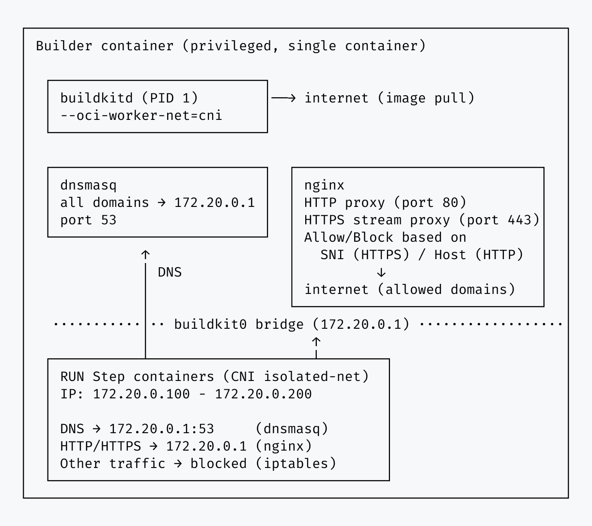

# Buildcage


[](https://github.com/dash14/buildcage)


**Secure your Docker builds against supply chain attacks — restrict outbound network access to only the domains you allow.**

When you run `RUN npm install` or `RUN pip install` in a Dockerfile, those commands can execute arbitrary code and make outbound connections to any server on the internet — without visibility or control. A compromised dependency could silently exfiltrate your build secrets or phone home to an attacker's server.

Buildcage prevents this. You define a list of allowed domains, and only those connections are permitted during builds. Everything else is blocked.

No Dockerfile changes required. No proxy configuration needed. No certificates to install. Works with any language or package manager.


## How It Works

Buildcage runs as a [remote driver](https://docs.docker.com/build/builders/drivers/remote/) for Docker Buildx. All `RUN` step containers are placed on an isolated network, and outbound traffic is routed through a proxy that enforces your allowlist.


- HTTPS: SNI (Server Name Indication) for domain matching — TLS is not terminated
- HTTP: Host header for domain matching
- Direct IP access: blocked unless explicitly allowed
- Non-TCP protocols (UDP, ICMP, etc.): all blocked — only TCP connections are supported

**Two modes available** (see [Reference](#reference) for details):

- **Audit mode**: Records all network destinations during builds, useful for creating allowlists.
- **Restrict mode**: Allows access only to permitted domains, blocking everything else.

## Who Should Use This?

### Recommended for:

- **CI/CD pipelines pulling from public registries** — if your builds download packages from npm, PyPI, RubyGems, or other public sources, Buildcage limits the blast radius of compromised packages
- **Builds that handle secrets** — if your Dockerfiles use build secrets, tokens, or credentials, Buildcage prevents them from being exfiltrated to unauthorized servers
- **Teams that need network visibility** — if you need to know exactly which external services your builds contact, Buildcage logs every outbound connection and can enforce an allowlist

### May not be necessary for:

- **Fully offline builds** — if your builds run in an air-gapped environment with no external network access
- **Internal-only registries** — if all dependencies come from vetted, internal repositories with no public package sources
- **No-dependency builds** — if your Dockerfile only copies files and never runs commands that fetch external resources

## Features

- 🚀 **GitHub Actions support**: Available as reusable actions for CI/CD pipelines
- ✅ **Zero Dockerfile changes**: Works with existing Dockerfiles without modification
- 🔒 **Network isolation**: Isolates network access for each `RUN` step using CNI (Container Network Interface)
- 🔍 **Audit mode**: Discover dependencies before enforcing restrictions
- 🛡️ **Restrict mode**: Production-ready access control
- 📊 **Detailed logging**: Complete visibility into all network connections during builds

## Quick Start

### Prerequisites

- Docker with BuildKit (buildx plugin)
- GitHub Actions runner with Docker support (for CI/CD usage)
- Docker Compose (for local usage)

### First-Time Setup (Recommended Workflow)

Using Buildcage in GitHub Actions involves three workflow steps:

1. Start the Buildcage container (runs BuildKit inside a network-controlled environment)
2. Configure Docker Buildx to use the Buildcage container as a remote builder
3. Run your build as usual — your Dockerfile and build commands stay the same

#### Step 1: Discover what domains your build needs (Audit Mode)

```yaml
name: Discover Build Dependencies

on: [push]

jobs:
  audit:
    runs-on: ubuntu-latest
    steps:
      - uses: actions/checkout@de0fac2e4500dabe0009e67214ff5f5447ce83dd # v6.0.2

      - name: Start Buildcage in audit mode
        id: buildcage
        uses: dash14/buildcage/setup@b9d14782cead3b80b89244ce718174e699bcd759 # v2.1.0
        with:
          proxy_mode: audit  # Log everything, block nothing

      - name: Set up Docker Buildx
        uses: docker/setup-buildx-action@4d04d5d9486b7bd6fa91e7baf45bbb4f8b9deedd # v4.0.0
        with:
          driver: remote
          endpoint: docker-container://buildcage

      - name: Build and discover dependencies
        uses: docker/build-push-action@d08e5c354a6adb9ed34480a06d141179aa583294 # v7.0.0
        with:
          context: .
          push: false  # Set to true to push the built image

      - name: Show Buildcage report
        if: always()
        uses: dash14/buildcage/report@b9d14782cead3b80b89244ce718174e699bcd759 # v2.1.0
        with:
          fail_on_blocked: false  # Don't fail, just show the report
```

See the [complete example workflow](.github/workflows/example-audit.yml).

#### Step 2: Check the report

The report action outputs a Job Summary showing every domain your build contacted:


Copy these domain names into `allowed_https_rules` or `allowed_http_rules` for Step 3.

#### Step 3: Create your allowlist and switch to restrict mode

```yaml
name: Secure Build

on: [push]

jobs:
  build:
    runs-on: ubuntu-latest
    steps:
      - uses: actions/checkout@de0fac2e4500dabe0009e67214ff5f5447ce83dd # v6.0.2

      - name: Start Buildcage in restrict mode
        id: buildcage
        uses: dash14/buildcage/setup@b9d14782cead3b80b89244ce718174e699bcd759 # v2.1.0
        with:
          proxy_mode: restrict  # Block everything except allowed domains
          allowed_https_rules: >-
            registry.npmjs.org:443
            fonts.googleapis.com:443

      - name: Set up Docker Buildx
        uses: docker/setup-buildx-action@4d04d5d9486b7bd6fa91e7baf45bbb4f8b9deedd # v4.0.0
        with:
          driver: remote
          endpoint: docker-container://buildcage

      - name: Build with protection
        uses: docker/build-push-action@d08e5c354a6adb9ed34480a06d141179aa583294 # v7.0.0
        with:
          context: .
          push: false  # Set to true to push the built image

      - name: Show Buildcage report
        if: always()
        uses: dash14/buildcage/report@b9d14782cead3b80b89244ce718174e699bcd759 # v2.1.0
        # Build fails if any unexpected connections were blocked
```

See the [complete example workflow](.github/workflows/example-restrict.yml).

Your builds are now protected. Any unexpected connections will be blocked and reported.

## Reference

### Setup Action (`dash14/buildcage/setup`)

Starts the Buildcage builder container.

```yaml
- name: Start Buildcage builder
  id: buildcage
  uses: dash14/buildcage/setup@b9d14782cead3b80b89244ce718174e699bcd759 # v2.1.0
  with:
    proxy_mode: restrict
    allowed_https_rules: registry.npmjs.org:443 github.com:443
```

#### Parameters

| Parameter | Required | Default | Description |
|-----------|----------|---------|-------------|
| `builder_name` | No | `buildcage` | Name of the builder container |
| `proxy_mode` | No | `restrict` | Operation mode (`audit` / `restrict`) |
| `allowed_https_rules` | No | empty | HTTPS allow rules (wildcard or regex, port required) |
| `allowed_http_rules` | No | empty | HTTP allow rules (wildcard or regex, port required) |
| `allowed_ip_rules` | No | empty | IP address allow rules (wildcard or regex, port required) |

> [!NOTE]
> The Docker image is always pulled from `ghcr.io/<action-owner>/<action-repo>` and its
> build provenance is cryptographically verified (keyless signature) before the image is pulled.
> External image overrides are not supported to preserve this guarantee. For best security, pin the
> action to a commit SHA: `uses: dash14/buildcage/setup@<40-char-sha> # vX.Y.Z`
>
> Self-hosting with a custom image requires forking the repository. See the [Self-Hosting Guide](./docs/self-hosting.md).
> If the action package is private (self-hosted in a private repository), run
> [`docker/login-action`](https://github.com/docker/login-action) with `packages: read` before this
> action — credentials stored by Docker are picked up automatically.

**Rule syntax**

| Pattern | Example | Matches |
|---------|---------|---------|
| Exact domain | `example.com:443` | `example.com` on port 443 only |
| Single-level wildcard | `*.example.com:443` | `sub.example.com` on port 443 (not `deep.sub.example.com`) |
| Multi-level wildcard | `**.example.com:443` | `sub.example.com` and `deep.sub.example.com` on port 443 |
| Single-char wildcard | `exampl?.com:443` | `example.com`, `examplx.com` on port 443 |
| Wildcard port | `example.com:*` | `example.com` on any port |
| Regex | `~^custom\.pattern:\d+$` | Matched against `domain:port` |

IP address rules (e.g., `192.168.1.1:443`) use the same syntax but go in `allowed_ip_rules`.

For detailed syntax, see [Rule Syntax](./docs/rules.md).

#### Connecting Buildx

Pass the container name to [`docker/setup-buildx-action`](https://github.com/docker/setup-buildx-action) to use Buildcage as a remote builder. The `endpoint` must match the `builder_name` parameter (default: `buildcage`):

```yaml
- name: Set up Docker Buildx
  uses: docker/setup-buildx-action@4d04d5d9486b7bd6fa91e7baf45bbb4f8b9deedd # v4.0.0
  with:
    driver: remote
    endpoint: docker-container://buildcage
```

#### Operation Modes

##### Audit Mode (`proxy_mode: audit`)

**When to use:** First-time setup, adding new dependencies, or investigating issues.

**What it does:**
- Allows all HTTP/HTTPS connections (except requests missing a Host header or SNI)
- Logs every domain accessed during the build

##### Restrict Mode (`proxy_mode: restrict`)

**When to use:** Production builds, CI/CD pipelines, security-critical environments.

**What it does:**
- Allows connections only to domains in `allowed_http_rules` / `allowed_https_rules`
- Blocks all other connections
- Logs allowed and blocked attempts

#### Tips

- Start with audit mode to discover required domains, then switch to restrict mode.
- Separate HTTP and HTTPS domains — some services use different hosts for each protocol.
- Common package registries often use multiple domains (e.g., PyPI uses both `pypi.org` and `files.pythonhosted.org`).
- Some package managers download over plain HTTP (e.g., certain Debian mirrors). Add those domains to `allowed_http_rules` separately:

  ```yaml
  allowed_http_rules: deb.debian.org:80
  allowed_https_rules: registry.npmjs.org:443
  ```


### Report Action (`dash14/buildcage/report`)

Displays communication logs after builds and optionally fails if any BLOCKED connections are found.

```yaml
- name: Show proxy report
  if: always()
  uses: dash14/buildcage/report@b9d14782cead3b80b89244ce718174e699bcd759 # v2.1.0
```

#### Job Summary

**Audit mode:**


Use the domain names shown in the report to create your allowlist for restrict mode.

**Restrict mode:**


In restrict mode, the report step fails if blocked connections are detected, causing the workflow to fail. You can disable this by setting `fail_on_blocked: false`. In audit mode, blocked connections (e.g., protocol errors) are reported but never cause the step to fail.

#### Parameters

| Parameter | Required | Default | Description |
|-----------|----------|---------|-------------|
| `builder_name` | No | `buildcage` | Name of the builder container |
| `fail_on_blocked` | No | `true` | Fail the step if blocked connections are detected (restrict mode only; ignored in audit mode) |

---

## Architecture

### For Technical Users

Buildcage creates a controlled network environment for your Docker builds:

1. **BuildKit RUN steps run in isolated containers** connected to a private network (CNI)
2. **All DNS queries return the proxy IP** (172.20.0.1), forcing traffic through the proxy
3. **The proxy inspects each request:**
   - HTTPS: Reads the SNI (Server Name Indication) without decrypting
   - HTTP: Reads the Host header
4. **Allowlist check:** If the domain is allowed → connection proceeds. Otherwise → blocked.

**Note:** Base image pulls (`FROM` instructions) are performed by buildkitd itself, which runs outside the isolated network. Only commands in `RUN` steps are subject to network filtering.

**Why this approach?**
- No MITM certificate injection needed
- TLS certificate validation works normally
- Zero modification to your Dockerfile required
- Works with any programming language or package manager
- Cannot inspect encrypted HTTPS payload content (see [Security Considerations](#security-considerations))

### Architecture Diagram



All containers spawned by BuildKit `RUN` steps are placed on an isolated network (CNI). DNS queries are redirected to the proxy IP, and the proxy checks each request's SNI (HTTPS) or Host header (HTTP) against the allowlist before forwarding or blocking.

---

## Security Considerations

> [!IMPORTANT]
> Buildcage controls *where* your builds can connect, not *what code* they run. If a malicious package is delivered through a legitimate repository (e.g., a compromised npm package hosted on `registry.npmjs.org`), Buildcage cannot detect or prevent it — the connection goes to an allowed domain.
>
> Do not rely on Buildcage as your sole supply chain security measure. Use it as one layer in a defense-in-depth strategy — a last line of defense. If something slips through your other measures, at least it can't call home.

### What Buildcage protects against

Buildcage blocks outbound connections to domains not on your allowlist during Docker builds. This helps mitigate scenarios such as:

- **Data exfiltration** — prevents build secrets (e.g., environment variables, tokens) from being sent to external servers
- **Command-and-control (C2) communication** — blocks compromised dependencies from phoning home to attacker-controlled servers
- **Unexpected telemetry** — stops analytics, tracking, or other undisclosed network calls that packages may make during installation

### Security mechanisms and attack resistance

Buildcage enforces network isolation through DNS-level control, HTTP/HTTPS proxy filtering, iptables rules, and CNI network isolation. These mechanisms defend against SNI spoofing, ECH bypass, DNS tunneling, non-TCP protocol tunneling, IPv6 bypass, and alternative DNS transports (DoH/DoT).

For full technical details, see the [Security Details](./docs/security.md) document.

### Known limitations

The only known bypass is **domain fronting** — a technique where an attacker sets the SNI to an allowed domain but routes the actual request to a different server on the same CDN. This requires the attacker's server to share infrastructure with an allowed domain, making it a narrow attack surface. See [Known Limitations](./docs/security.md#known-limitations) for details and mitigation strategies.

### Trusting the Buildcage image

Buildcage is a security tool — so it's fair to ask: *how do you trust Buildcage itself?*

The upstream image is verified at action startup via Sigstore: the signature cryptographically binds the published image to the exact source commit SHA, so a tampered or substituted image fails verification before use. Both options below rely on this guarantee.

**Using the upstream image**

The simplest option. Pin to a commit SHA (or version tag) and update on your own schedule — the Sigstore verification ensures you are always running exactly what was built from that commit.

**Self-hosting**

Import this repository into your own GitHub organization and build the Docker image within your own infrastructure. Useful when you need to:

- Keep build infrastructure private within your organization
- Control exactly which version is deployed and when updates are applied
- Meet compliance requirements that mandate use of an internal container registry

See the [Self-Hosting Guide](./docs/self-hosting.md) for setup instructions.

## FAQ

- **Can I host Buildcage in my own private repository?**

  Yes. See [Trusting the Buildcage image](#trusting-the-buildcage-image) for details.

- **Does this slow down my builds?**

  Minimal impact. The proxy adds negligible latency (<1ms per request). DNS caching and connection pooling keep overhead low.

- **Can I use this with multi-stage builds?**

  Yes. Buildcage works seamlessly with multi-stage Dockerfiles.

- **Does this work with private package registries?**

  Yes. Just add your private registry's domain to `allowed_https_rules` (e.g., `registry.example.com:443`).

- **What happens if I forget to add a required domain?**

  In restrict mode, the build will fail with a clear error message. Run in audit mode first to discover all required domains.

- **Do I need to clean up the Buildcage container?**

  No. The container is automatically removed when the GitHub Actions job completes.

- **Can I allow access to an IP address (e.g., `http://192.168.1.1`)?**

  Yes. Add the IP address with a port to `allowed_ip_rules` (e.g., `192.168.1.1:443`). Only IPv4 addresses are supported; CIDR notation is not supported.

- **Does this protect against malicious code execution?**

  No. Buildcage only controls network access. It doesn't prevent malicious code from running—it prevents that code from communicating with external servers.

## Troubleshooting

If you encounter issues, try reproducing the problem locally to get detailed logs:

1. **Check logs:**
   ```bash
   docker compose logs builder
   ```

2. **Run in audit mode** to understand your build's network behavior:
   ```bash
   make clean
   make run_audit_mode
   docker buildx build --builder buildcage --no-cache -f Dockerfile .
   docker compose logs builder
   ```

3. **Open an issue** at [github.com/dash14/buildcage/issues](https://github.com/dash14/buildcage/issues) with:
   - Your Dockerfile
   - The audit mode report output
   - Full error messages from `docker compose logs builder`

## Development

See the [Development Guide](./docs/development.md) for local usage, testing, viewing logs, and directory structure.

## Contributing

Contributions are welcome! Please feel free to submit issues or pull requests at [github.com/dash14/buildcage](https://github.com/dash14/buildcage).

## Show Your Support

Knowing that this project is useful to others gives me the motivation to keep working on it.
If you find Buildcage helpful, please consider giving it a star ⭐ on GitHub!

## Disclaimer

This software is provided "as is", without warranty of any kind, express or implied. The authors and contributors are not liable for any damages, losses, or security incidents arising from the use of this software. Use at your own risk.

## License
The Buildcage source code is licensed under the MIT License. See [LICENSE](./LICENSE) file for details.

The Docker image includes third-party components under their own licenses (GPL, Apache 2.0, ISC, etc.). See [THIRD_PARTY_LICENSES](./THIRD_PARTY_LICENSES) for the full list.