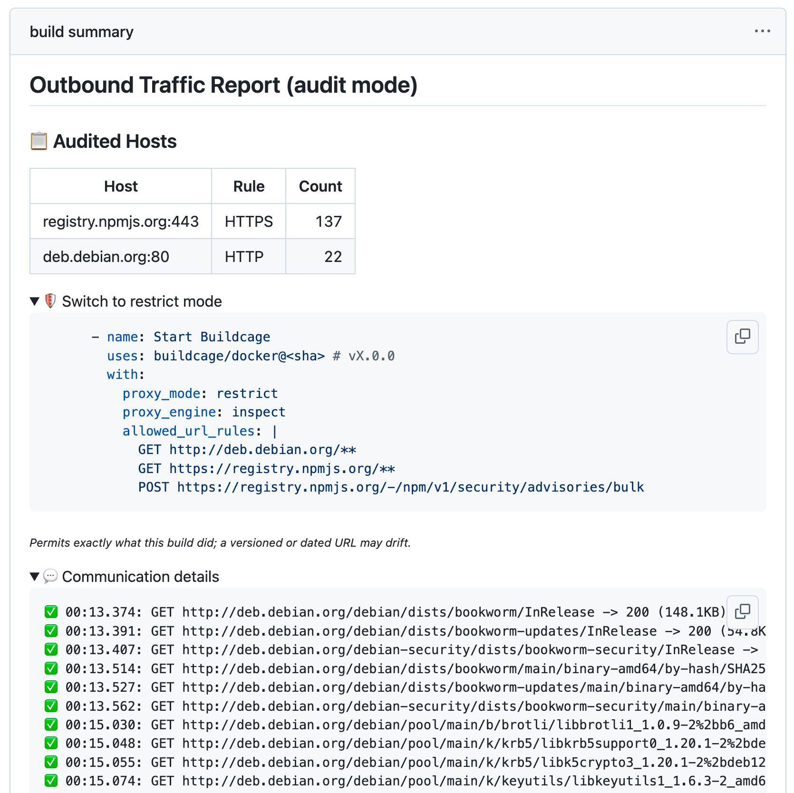
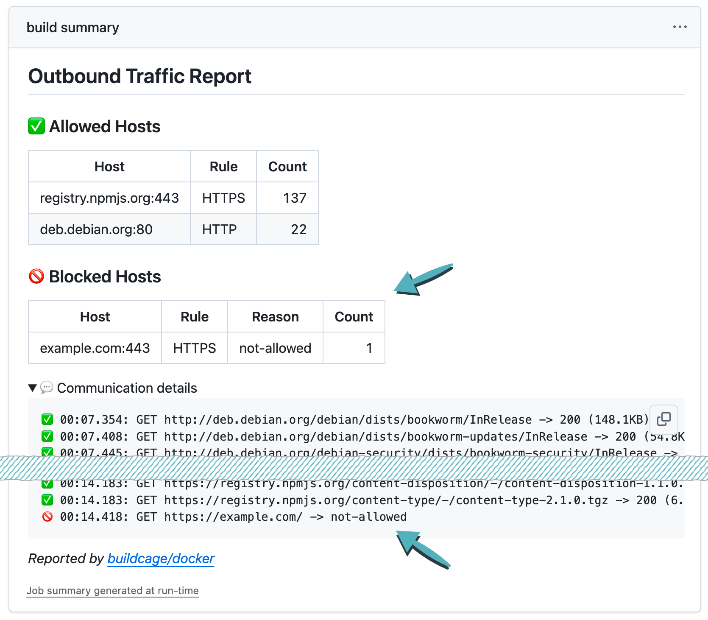

# Buildcage for Docker


[](https://github.com/buildcage/docker)
[](https://github.com/marketplace/actions/buildcage-for-docker)


GitHub Action that restricts where `docker build` can connect. Every `RUN` step runs behind an
allowlist you write, and a destination that isn't on it is refused and reported.

- Your Dockerfile doesn't change, BuildKit isn't patched, and nothing Buildcage does is left in the
  image layers.
- Run once in [`audit`](#operation-modes) mode and the report writes the allowlist for you, ready to
  paste back into the workflow.
- A rule can name an HTTP method and a URL, inside TLS as well, so a build can fetch a package from
  a registry without being able to publish one to it.
- It all runs inside your GitHub Actions job, with no agent and no external service.

See [buildcage.github.io](https://buildcage.github.io/) for what it does and why. To isolate a
workflow `run:` step rather than a Docker build, use
[Buildcage for `run:` Steps](https://github.com/buildcage/isolated-run).

## Contents

- [Requirements](#requirements)
- [Usage](#usage)
- [Engines](#engines)
- [Inputs](#inputs)
- [Report action](#report-action)
- [How it works](#how-it-works)
- [CA trust and compatibility](#ca-trust-and-compatibility)
- [Scope](#scope)
- [Limitations](#limitations)
- [FAQ](#faq)
- [GitHub's native egress firewall](#githubs-native-egress-firewall)
- [Documentation](#documentation)

## Requirements

The builder is a container on the runner itself, so this action needs a Linux runner with a working
Docker installation:

- **GitHub-hosted**
  - `ubuntu-latest`, the versioned `ubuntu-*` images, and their `-arm` variants
  - Lightweight images such as `ubuntu-slim` are not supported: they ship a Docker client with no
    daemon
- **Self-hosted**
  - Docker Engine 25.0 or later, with Compose v2.20.2 or later
  - A host using cgroup v2

A runner that falls short fails while the builder starts, before any `RUN` step runs.

## Usage

Buildcage starts a BuildKit builder in your job. Point Docker Buildx at it as a remote driver and
build as usual. Run once in [`audit`](#operation-modes) mode to collect what the build reaches, then
switch to `restrict`. The examples below use the `inspect` engine; [Engines](#engines) covers the
choice between the two.

### 1. Find out what the build reaches

```yaml
- name: Start Buildcage in audit mode
  uses: buildcage/docker@d6f130e3476121607affc037e1c56fafb48ea897 # v3.2.1
  with:
    proxy_mode: audit # Log every destination, block nothing
    proxy_engine: inspect # Record the method and URL of every request

- name: Set up Docker Buildx
  uses: docker/setup-buildx-action@37fe631027851001ddb9b187196cc803df7f5f0e # v4.3.0
  with:
    driver: remote
    endpoint: docker-container://buildcage

- name: Build
  uses: docker/build-push-action@53b7df96c91f9c12dcc8a07bcb9ccacbed38856a # v7.3.0
  with:
    context: .

- name: Show Buildcage report
  if: always()
  uses: buildcage/docker/report@d6f130e3476121607affc037e1c56fafb48ea897 # v3.2.1
```

The [report action](#report-action) writes every destination the build contacted to the Job Summary:



Its **Switch to restrict mode** section holds the allowlist, already written out from what the build
actually did.

### 2. Enforce the allowlist

Paste that allowlist into the setup step and switch the mode:

```yaml
- name: Start Buildcage in restrict mode
  uses: buildcage/docker@d6f130e3476121607affc037e1c56fafb48ea897 # v3.2.1
  with:
    proxy_mode: restrict
    proxy_engine: inspect
    allowed_url_rules: |
      GET http://deb.debian.org/**
      GET https://registry.npmjs.org/**
      POST https://registry.npmjs.org/-/npm/v1/security/advisories/bulk
```

Each rule names the methods it permits, so this one lets npm fetch packages without letting it
publish any: a `POST` to the same host is refused, as is every host not listed.



A blocked connection fails the job at the report step, so a build that starts reaching somewhere new
doesn't pass unnoticed.

### Example workflows

Each pair builds the same Dockerfile with and without rules:
`inspect` on an apt and npm build ([audit](.github/workflows/example-inspect-audit.yml) ·
[restrict](.github/workflows/example-inspect-restrict.yml)), `universal` on a Maven build
([audit](.github/workflows/example-universal-audit.yml) ·
[restrict](.github/workflows/example-universal-restrict.yml)).

## Engines

`proxy_engine` selects how closely the build's traffic is examined.

|                                             | `inspect`<br>terminates TLS, checks method and URL          | `universal`<br>reads the SNI only, checks host and port |
| ------------------------------------------- | ----------------------------------------------------------- | ------------------------------------------------------- |
| A rule can say                              | `GET\|HEAD https://registry.npmjs.org/**`                   | `registry.npmjs.org:443`                                |
| Allow a fetch, refuse a publish, same host  | ✅                                                          | -                                                       |
| The report shows                            | Every request with its URL                                  | Host and port                                           |
| The build's TLS                             | Terminated and re-signed with a CA generated for that build | Untouched                                               |
| Certificate pinning, or the JVM's own store | -                                                           | ✅                                                      |

Start with `inspect`, and fall back to `universal` when something in the build won't accept the
injected CA. `universal` is the default value of `proxy_engine`, so `inspect` has to be set
explicitly.

Both intercept at the network level, so a tool that ignores `HTTP_PROXY` is covered either way, and
both apply to `RUN` steps. What buildkitd fetches for itself stays outside: see
[Limitations](#limitations).

`proxy_engine: explicit` is BuildKit's own native `--proxy-network`. It still works but is
deprecated and receives no further development; see
[Explicit Proxy Engine](./docs/explicit-engine.md) if you already depend on it, most commonly for
its BuildKit-native SLSA provenance integration.

## Inputs

Every input is optional, and the ones below are the rules you write by hand. The full list, with
defaults and the engines each input applies to, is in
[Reference](./docs/reference.md#setup-action-inputs), and the grammar those rules are written in is
in [Rule syntax](./docs/reference.md#rule-syntax).

The builder is named `buildcage` unless `builder_name` says otherwise, and the Buildx `endpoint` has
to match whatever it is named.

### Operation modes

`proxy_mode: audit` logs every destination the build reaches and blocks nothing. `restrict`, the
default, allows only what the rules match and blocks and logs everything else. Start with `audit`
when you first adopt Buildcage or when a dependency changes, and keep `restrict` for everyday
builds.

If you forget a domain the build needs, `restrict` blocks it and the report step fails with the
destination named, which is why it is worth running `audit` first.

### Rules for the `inspect` engine

`allowed_url_rules` is the one to reach for. Each line is a method list, a space, and a URL pattern.
`*` stays inside one domain label or path segment, `**` crosses dots and slashes, and a rule with no
path allows any path on that host:

```yaml
allowed_url_rules: |
  # apt
  GET http://deb.debian.org/**

  # npm: fetch packages, and the audit endpoint it posts to
  GET https://registry.npmjs.org/**
  POST https://registry.npmjs.org/-/npm/v1/security/advisories/bulk

  # pip: one registry, two domains
  GET https://pypi.org/simple/**
  GET https://files.pythonhosted.org/packages/**

  # a private registry is an ordinary host
  GET|HEAD https://registry.internal.example.com:8443/**
```

`allowed_tls_rules` passes a TLS destination through undecrypted, judged on its SNI and port. It is
for TLS that isn't HTTPS, and for the hosts an `inspect` build must not decrypt:

```yaml
allowed_tls_rules: |
  db.example.com:5432
  repo.maven.apache.org:443
```

`allowed_ip_rules` covers connections made straight to an address, which never go through DNS. Under
`inspect` a rule may be an address or a CIDR block:

```yaml
allowed_ip_rules: |
  192.168.1.10:443
  10.0.0.0/8:443
```

### Rules for the `universal` engine

`universal` never decrypts, so rules name a host and a port. `allowed_https_rules` and
`allowed_http_rules` split by scheme, and `allowed_ip_rules` takes an address or a wildcard:

```yaml
allowed_https_rules: |
  registry.npmjs.org:443
  repo.maven.apache.org:443
  *.internal.example.com:443

allowed_http_rules: |
  deb.debian.org:80

allowed_ip_rules: |
  192.168.1.10:443
```

### Destinations you expect to stay blocked

A noisy dependency, or a domain you are deliberately keeping off the allowlist to confirm it stays
blocked, belongs in `known_blocked_rules`. Those rows are marked **Expected** in the report and stop
failing the job, and the destination stays unreachable:

```yaml
known_blocked_rules: |
  telemetry.example.com
```

## Report action

`buildcage/docker/report` reads the builder's communication log and writes the Job Summary. Add it
with `if: always()` so a failing build still reports:

```yaml
- name: Show Buildcage report
  if: always()
  uses: buildcage/docker/report@d6f130e3476121607affc037e1c56fafb48ea897 # v3.2.1
```

Whatever was refused is listed under **Blocked Hosts** with the reason, and, under `inspect`,
**Communication details** names the URL of every request, allowed or refused, with credential query
parameters replaced (see [Credentials in a URL](docs/security.md#credentials-in-a-url)). In `audit`
mode the summary also holds the **Switch to restrict mode** allowlist.

In `restrict` mode the step fails when a blocked connection is found, and with it the workflow. Pass
`fail_on_blocked: false` to report without failing, or list what you expect to stay blocked in the
setup action's `known_blocked_rules`. In `audit` mode nothing fails the step. The action's inputs
are in [Reference](./docs/reference.md#report-action-inputs).

### Traffic artifact

`upload_traffic_artifact: true` uploads the whole timeline as a `traffic.json`, one row per request
and per name lookup, with the method, URL, status, size and the address it resolved to. It is
uploaded even when the build fails, and `inspect` is the only engine that has anything to put in it.
The fields are listed in [Reference](./docs/reference.md#traffic-artifact).

## How it works


BuildKit itself is unpatched. Buildcage starts it with a network configuration that puts every `RUN`
step on its own network, and wraps its runtime so the build CA is mounted into a step for as long as
that step runs. Name lookups and traffic from there reach the resolver and the proxy in the builder
container, at the network level, so a tool that ignores the proxy environment variables is covered as
well. The figure is the `inspect` engine; `universal` follows the same path without terminating TLS,
and so needs no CA.

Buildx needs `driver: remote` because the builder is a second BuildKit, but multi-stage builds,
caching and the image that comes out are unaffected, and nothing Buildcage does reaches the LLB or a
cache key.

[Security Details](./docs/security.md) has the architecture of each engine, with a diagram of what
runs where and what it decides. [Development Guide](./docs/development.md) has the implementation.

## CA trust and compatibility

`proxy_engine: inspect` terminates TLS and re-signs it with a CA generated for that build, so the
build has to trust that CA. As each `RUN` step starts, Buildcage adds it to the step's own CA store
and points the variables the common toolchains read at one that holds it: `NODE_EXTRA_CA_CERTS`,
`DENO_CERT`, `CURL_CA_BUNDLE`, `SSL_CERT_FILE`, `REQUESTS_CA_BUNDLE` and `PIP_CERT`. An image with
no store of its own gets one written for it, so a tool that goes by its own compiled-in path rather
than any variable, as Debian's wget and git do, still verifies. A variable the base image or the
Dockerfile already set is appended to rather than redirected, and neither the CA nor the variables
are left in the image layers.

The full table is in [Reference](./docs/reference.md#ca-trust-variables). What this cannot cover is
in [Limitations](#limitations), below.

## Scope

Buildcage controls _where_ your build can connect, not _what code_ it runs. A malicious package
delivered through an allowed domain still runs. Treat it as one layer in a defense-in-depth
strategy, a last line of defense so that if something slips through your other measures, at least it
can't call home.

An allowlist also cannot stop anything leaving through a service you had to allow anyway. That is a
structural limit. What it does stop is traffic to a destination that is not on the list, and
infrastructure an attacker set up is normally not on it, because the build has no reason to reach
it. That is also the hardest kind of leak to find afterwards.

An allowlist generated from an audit run already blocks every destination the audit did not record.
Whether to go further depends on what the build has access to:
[Hardening](./docs/security.md#hardening) is what to look at when it holds credentials, personal
data, or source you do not publish. For the full threat model, see
[Security Details](./docs/security.md).

## Limitations

### What isn't covered

- buildkitd's own traffic is outside the allowlist. `FROM`, `ADD <url>`, git contexts and the
  frontend image a `# syntax=` directive names are fetched by buildkitd itself rather than by a
  `RUN` step, and no rule applies to them.
  See [What buildkitd fetches itself](./docs/security.md#what-buildkitd-fetches-itself).
- `allowed_tls_rules` is not decrypted. The SNI and the port are checked, and the proxy resolves
  that name itself, so the connection reaches the host the rule named, but nothing inside the TLS
  session is seen.
- `allowed_ip_rules` is not inspected at all, and doesn't require TLS either: once an `ip:port` pair
  is allowed, any TCP-based protocol can use that path. Prefer a domain rule wherever the
  destination has a stable name.
- `universal` never sees the method or the path. They travel inside TLS, so neither is enforced and
  neither reaches the report or the traffic artifact. A request fronted behind an allowed SNI is
  invisible to it as well, while `inspect` matches on the real `Host` and refuses it. See
  [What it can't see](./docs/security.md#what-it-cant-see).

### Protocols

- UDP is dropped, so QUIC and HTTP/3 either fall back to TCP or fail. Port 53 to the proxy, which is
  the resolver, is the one exception. ICMP is dropped too.
- IPv6 is not used anywhere. The rule syntax refuses an IPv6 address, forwarded IPv6 is dropped, and
  the proxy reaches allowed names over IPv4 only, so an allowed name with AAAA records and no A
  record never resolves and no rule can clear it.

### Service discovery

The resolver has no upstream, so it returns nothing for a discovery record: `SRV`, `TXT`, `TLSA` and
`URI` queries come back empty, and the build connects to the name a rule allowed rather than to one
a nameserver picked for it. Clients that treat `SRV` as a discovery layer fall back to the host name
itself, so the host a rule names is the host the build reaches.

What this breaks is a client with no fallback, where the record is the only way it can find the
service at all. A `mongodb+srv://` connection string is the one to expect: use `mongodb://` with the
shard hostnames written out and allowlist those instead. Active Directory and Kerberos discovery
have the same shape.

Under `inspect`, a lookup for a `_service._proto.<host>` name is reported as `discovery` when the
rules allow that host, and is not counted as blocked. A service name under any other host is
reported as blocked; see
[Blocked service names](./docs/reference.md#blocked-service-names).

### Under the `inspect` engine

- A tool that pins a certificate, or ships its own trust store instead of reading the CA-trust
  variables, will not work. The JVM (Java, Kotlin, Scala) is the common case, since it only reads
  its own `cacerts` file. Use `proxy_engine: universal` for those, or pass the host through
  undecrypted with `allowed_tls_rules`.
- `audit` terminates TLS as well. It drops the rules, not the interception, so a tool that cannot
  accept the CA fails in `audit` exactly as it would in `restrict`.
- An image with no system CA store (`scratch`, distroless, `ubi*-micro`, or `debian:*-slim` before
  `ca-certificates` is installed) gets one written for it holding the build's CA. That covers
  ordinary HTTPS, since `inspect` re-signs all of it with that CA, but not an `allowed_tls_rules` or
  `allowed_ip_rules` passthrough: that presents its own real certificate, which needs public roots
  the image does not have. Installing `ca-certificates` brings those in, and the build's CA survives
  the rebuild, so a passthrough later in the same step works:

  ```dockerfile
  RUN apt-get install -y ca-certificates && \
      curl https://internal.example.com/pkg.tgz -o pkg.tgz   # works: the rebuilt store carries the
                                                             # public roots and the build's CA
  ```

- Where the image shipped a CA store of its own, its directory is a mount point for the step's
  duration, so removing or renaming the directory itself fails, while what is inside it behaves
  normally:

  ```dockerfile
  RUN rm -rf /etc/ssl/certs        # fails: the directory is a mount point
  RUN rm -rf /etc/ssl/certs/*      # fine
  ```

- A custom CA path that is unexpectedly large (more than 20 MiB or 512 files) has injection skipped
  for that variable only, the same degradation as when no CA bundle is found at all.
- Neither engine produces SLSA provenance. The deprecated `explicit` engine records what it fetched
  as a provenance material through BuildKit's own mechanism; the traffic artifact is an observation
  record with no content digest.

### On the runner itself

An allowlisted name that resolves to cloud metadata, to loopback, or to an address the runner itself
holds is refused, so a compromised name cannot turn the proxy into a route back into the runner. A
mirror or registry running on the runner is therefore not reachable by name: allow it with
`allowed_ip_rules`, which never goes through that guard. See
[What it actually stops](./docs/security.md#what-it-actually-stops).

### What the audit allowlist covers

The generated allowlist covers only what the engine classified. `allowed_tls_rules` and
`allowed_ip_rules` come back exactly as the audit run was configured with them, since nothing behind
a passthrough was ever decrypted.

## FAQ

**Can I keep `inspect` but leave a few hosts undecrypted?**

Yes, that is what `allowed_tls_rules` is for. The SNI and port are checked and the connection passes
through untouched, so a JVM build or a tool that pins a certificate can sit inside an otherwise
inspected build. Those hosts are enforced at host-and-port granularity, the same as `universal`.

**A host only ever gets looked up, never connected to. How do I write a rule for it?**

The report gives it a row with `DNS` as the rule kind and no port. If you want it to stay
unreachable without failing the job, put the name in `known_blocked_rules`, which is the one input
where a rule may omit the port. If the build actually needs it, write an ordinary host or URL rule
and the lookup is reported as allowed.

**One registry needs several domains. How do I find them all?**

Run `audit` and read the report. PyPI, for example, uses both `pypi.org` and
`files.pythonhosted.org`, and the audit report lists every domain the build touched, so the
generated allowlist already has them.

**Which engine should I start with?**

`inspect`, unless something in the build carries its own trust store. It is the only engine that can
tell a fetch from a publish on the same host. See [Engines](#engines).

## GitHub's native egress firewall

GitHub is building an egress firewall directly into Actions runners
([technical preview](https://github.com/github-early-access/actions-native-egress-firewall) as of
September 2026): opt a job into a firewall-enabled runner image and its traffic is inspected outside
the runner VM, in `log` or `enforce` mode, from a single `.github/egress-firewall.yaml` in the
repository. Because it sits outside the VM, a workflow that gains root inside the runner cannot
switch it off. Firewall-enabled images are GitHub-hosted and Linux only.

One policy for the whole run is one allowlist for every step in it: the destinations
`actions/checkout`, the caches and the setup actions need stay open to the build as well. Buildcage
writes a separate allowlist for the build you don't trust, so a `docker build` gets the hosts that
build needs and nothing else, and a rule there can name a method and a URL rather than only a host.
The two compose: a perimeter the job can't switch off, and a tighter policy inside it.

Buildcage also runs on any Linux runner with Docker, self-hosted included, rather than on a
firewall-enabled runner image.

## Documentation

| Doc                                                | What's in it                                                      |
| -------------------------------------------------- | ----------------------------------------------------------------- |
| [Reference](./docs/reference.md)                   | Every input, the rule syntax in full, and the report's own output |
| [Security Details](./docs/security.md)             | Architecture and threat model for every engine, attack resistance |
| [Development Guide](./docs/development.md)         | Local usage, testing, logs, and implementation internals          |
| [Explicit Proxy Engine](./docs/explicit-engine.md) | The deprecated `proxy_engine: explicit` in full                   |

## Contributing

Contributions are welcome! Please feel free to submit issues or pull requests at [github.com/buildcage/docker](https://github.com/buildcage/docker).

## Show Your Support

Knowing that this project is useful to others gives me the motivation to keep working on it.
If you find Buildcage helpful, please consider giving it a star ⭐ on GitHub!

## Disclaimer

This software is provided "as is", without warranty of any kind, express or implied. The authors and contributors are not liable for any damages, losses, or security incidents arising from the use of this software. Use at your own risk.

## License

The Buildcage source code is licensed under the MIT License. See [LICENSE](./LICENSE) file for details.

The Docker image includes third-party components under their own licenses (GPL, Apache 2.0, ISC, etc.). See [THIRD_PARTY_LICENSES](./THIRD_PARTY_LICENSES) for the full list.

The Actions bundle their npm dependencies (MIT, Apache 2.0, ISC) into the committed `dist/` files. See [THIRD_PARTY_LICENSES_NPM](./THIRD_PARTY_LICENSES_NPM) for their license texts.
