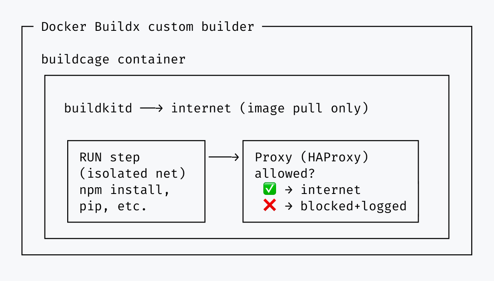
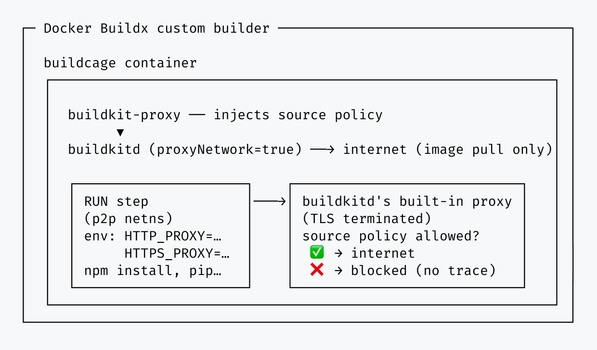

# Buildcage


[](https://github.com/dash14/buildcage)


**Secure your Docker builds against supply chain attacks — restrict outbound network access to only the domains you allow.**

When a compromised dependency pulled in by `RUN npm install`, `RUN pip install`, or any other build command tries to exfiltrate secrets or phone home, Buildcage blocks it — only the domains you specify are reachable. No Dockerfile changes, no proxy configuration, no certificates to install — works with any language or package manager.

This is not a hypothetical risk: the [Shai-Hulud npm worm](https://unit42.paloaltonetworks.com/npm-supply-chain-attack/) compromised hundreds of packages whose `postinstall` scripts exfiltrated CI/CD secrets straight out of the build environment — exactly the moment Buildcage is designed to guard.


*A build tries to reach an unexpected domain — Buildcage blocks it and records it in the report. This is what your report looks like after completing the audit → restrict flow below.*

## Features

- 🚀 **GitHub Actions support**: Available as reusable actions for CI/CD pipelines
- ✅ **Zero Dockerfile changes**: Works with existing Dockerfiles without modification
- 🔒 **Network isolation**: Isolates network access for each `RUN` step so only explicitly allowed destinations are reachable
- 🔍 **Audit mode**: Discover dependencies before enforcing restrictions
- 🛡️ **Restrict mode**: Enforce an allowlist — block everything else
- 📊 **Detailed logging**: Full visibility into every connection observed during builds

## Quick Start

Using Buildcage comes down to three steps: start the Buildcage container, point Docker Buildx at it
as a remote builder, then run your build as usual — your Dockerfile and build commands don't change.
The walkthrough below covers the full audit → restrict flow.

### Step 1: Discover what domains your build needs (Audit Mode)

```yaml
- name: Start Buildcage in audit mode
  id: buildcage
  uses: dash14/buildcage/setup@0f4a487d1062628ed90ca3cea661db00890c5e8c # v2.2.0
  with:
    proxy_mode: audit  # Log everything, enforce no allowlist

- name: Set up Docker Buildx
  uses: docker/setup-buildx-action@d7f5e7f509e45cec5c76c4d5afdd7de93d0b3df5 # v4.1.0
  with:
    driver: remote
    endpoint: docker-container://buildcage

- name: Build and discover dependencies
  uses: docker/build-push-action@f9f3042f7e2789586610d6e8b85c8f03e5195baf # v7.2.0
  with:
    context: .
    push: false  # Set to true to push the built image

- name: Show Buildcage report
  if: always()
  uses: dash14/buildcage/report@0f4a487d1062628ed90ca3cea661db00890c5e8c # v2.2.0
  with:
    fail_on_blocked: false  # Don't fail, just show the report
```

See the [complete example workflow](.github/workflows/example-audit.yml).

### Step 2: Check the report

The report action outputs a Job Summary showing every domain your build contacted:


*Same workflow, run first in audit mode — every domain is logged, nothing is blocked yet.*

Copy these domain names into `allowed_https_rules` or `allowed_http_rules` for Step 3.

### Step 3: Create your allowlist and switch to restrict mode

```yaml
- name: Start Buildcage in restrict mode
  id: buildcage
  uses: dash14/buildcage/setup@0f4a487d1062628ed90ca3cea661db00890c5e8c # v2.2.0
  with:
    proxy_mode: restrict  # Block everything except allowed domains
    allowed_https_rules: >-
      registry.npmjs.org:443
      fonts.googleapis.com:443

- name: Set up Docker Buildx
  uses: docker/setup-buildx-action@d7f5e7f509e45cec5c76c4d5afdd7de93d0b3df5 # v4.1.0
  with:
    driver: remote
    endpoint: docker-container://buildcage

- name: Build with protection
  uses: docker/build-push-action@f9f3042f7e2789586610d6e8b85c8f03e5195baf # v7.2.0
  with:
    context: .
    push: false  # Set to true to push the built image

- name: Show Buildcage report
  if: always()
  uses: dash14/buildcage/report@0f4a487d1062628ed90ca3cea661db00890c5e8c # v2.2.0
  # Build fails if any unexpected connections were blocked
```

See the [complete example workflow](.github/workflows/example-restrict.yml).

Your builds are now protected. Any unexpected connections will be blocked and reported.

For the full parameter reference, rule syntax, and operation modes, see the [Reference](./docs/reference.md) doc.

## Who Should Use This?

### Recommended for:

- **CI/CD pipelines pulling from public registries** — if your builds download packages from npm, PyPI, RubyGems, or other public sources, Buildcage limits the blast radius of compromised packages
- **Builds that handle secrets** — if your Dockerfiles use build secrets, tokens, or credentials, Buildcage prevents them from being exfiltrated to unauthorized servers
- **Teams that need network visibility** — if you need to know exactly which external services your builds contact, Buildcage logs every outbound connection and can enforce an allowlist

### May not be necessary for:

- **Fully offline builds** — if your builds run in an air-gapped environment with no external network access
- **Internal-only registries** — if all dependencies come from vetted, internal repositories with no public package sources
- **No-dependency builds** — if your Dockerfile only copies files and never runs commands that fetch external resources

## How It Works

Buildcage runs as a [remote driver](https://docs.docker.com/build/builders/drivers/remote/) for
Docker Buildx, and doesn't fork or patch BuildKit itself — it only extends how build traffic is
wired up around a stock `buildkitd`. All `RUN` step TCP traffic is routed through a proxy that
enforces your allowlist — other protocols (UDP, ICMP, etc.) are never allowed through. Two
**proxy engines** implement this — **transparent** (the default) and
**explicit** (experimental) — differing in *how* traffic is intercepted and how much visibility you get.

### Transparent Engine (default)



- All `RUN` step containers are placed on an isolated network (CNI)
- All DNS queries resolve to the proxy IP, forcing traffic through the proxy regardless of
  whether the tool making the request is proxy-aware
- HTTPS connections are matched by SNI (Server Name Indication) — TLS is not terminated
- HTTP connections are matched by their Host header
- Direct IP access is blocked unless explicitly allowed — and when allowed, that IP:port passes through as raw TCP with no HTTP/TLS inspection, unlike the domain-based rules above
- Non-TCP protocols (UDP, ICMP, etc.) are always blocked
- No proxy configuration or CA certificate is injected into the build — TLS validation works exactly as it would without Buildcage

Every TCP connection is forced through the proxy at the network level — no tool can opt out, whether
or not it respects proxy environment variables — so non-cooperative tools are still caught and logged
rather than failing invisibly.

### Explicit Engine (experimental)



Unlike `transparent`, which needs no proxy configuration or certificates at all, `explicit` relies on
injecting both: BuildKit's own `--proxy-network` isolates each `RUN` step and routes it through
buildkitd's built-in proxy, injecting `HTTP_PROXY`/`HTTPS_PROXY` and a CA certificate automatically —
no Dockerfile changes needed for tools that already respect these standard variables and trust the
system CA store. In exchange for full URL/path-level visibility and integration with BuildKit's own
build output and SLSA provenance, tools that ignore `HTTP_PROXY`/`HTTPS_PROXY` (or open a raw socket)
are blocked invisibly, with no trace in the report.

This engine is experimental — its underlying BuildKit feature is still maturing. One notable gap:
some package managers (e.g. npm) ship their own CA store instead of consulting the system one, so
they don't trust the injected CA by default and need a small Dockerfile change to avoid TLS errors
during `RUN` steps — see
[CA Trust for Tools with Their Own CA Store](./docs/reference.md#ca-trust-for-tools-with-their-own-ca-store)
in the Reference doc for exactly what to add.

Not sure which to use? See the [engine comparison](./docs/reference.md#proxy-engines) in the Reference
doc, and [Explicit Proxy Engine](./docs/security.md#explicit-proxy-engine) for the full technical
detail.

> [!IMPORTANT]
> Buildcage controls *where* your builds can connect, not *what code* they run. If a malicious package is delivered through a legitimate repository (e.g., a compromised npm package hosted on `registry.npmjs.org`), Buildcage cannot detect or prevent it — the connection goes to an allowed domain.
>
> Don't make Buildcage your only supply chain security measure. Use it as one layer in a defense-in-depth strategy — a last line of defense. If something slips through your other measures, at least it can't call home.
>
> See [Security Considerations](./docs/security.md) for full details.

## The Sandbox Action (Experimental)

Supply-chain attacks aren't limited to Docker builds — a compromised dependency can just as easily
phone home from a plain `run:` step (`npm install`, `pip install`, a test suite, a build script).
The `sandbox` action applies the same network-isolation technology to any command. It's
experimental — newer and less battle-tested than the `setup`/`report` actions above — see
[Security Details](./docs/security.md#sandbox-action) for its current known limitations:

```yaml
- name: Run tests with outbound network isolation
  uses: dash14/buildcage/sandbox@0f4a487d1062628ed90ca3cea661db00890c5e8c # v2.2.0
  with:
    proxy_mode: restrict
    allowed_https_rules: registry.npmjs.org:443
    run: |
      npm install
      npm test
```

Each step starts its own throwaway proxy, runs the isolated command with all capabilities dropped,
`no_new_privileges` set, and Docker-socket access removed, appends a report to the Job Summary, and
stops the proxy again. See the [Sandbox Action reference](./docs/reference.md#sandbox-action) for
parameters and the [Security Details](./docs/security.md#sandbox-action) for the full threat model.

See the [complete example workflow](.github/workflows/example-sandbox.yml).

## FAQ

- **Does this slow down my builds?**

  Minimal impact either way, though the two engines add overhead differently. The transparent
  engine (default) never terminates TLS — it inspects the SNI/Host header and passes the
  connection through, so the overhead is limited to the initial connection setup, not the full
  request. The explicit engine terminates TLS like a standard forward proxy, decrypting each
  request to enforce path-level rules, but this runs locally alongside the build and is not a
  meaningful bottleneck for typical build traffic.

- **Can I use this with multi-stage builds?**

  Yes. Buildcage doesn't fork or patch BuildKit itself — it only wires up how build traffic is
  routed — so multi-stage Dockerfiles work exactly as they would without Buildcage.

- **Does this work with private package registries?**

  Yes. Just add your private registry's domain to `allowed_https_rules` (e.g., `registry.example.com:443`).

- **What happens if I forget to add a required domain?**

  In restrict mode, the build will fail with a clear error message. Run in audit mode first to discover all required domains.

- **Do I need to clean up the Buildcage container?**

  No. The container is automatically removed when the GitHub Actions job completes.

- **Can I allow access to an IP address (e.g., `http://192.168.1.1`)?**

  Yes. Add the IP address with a port to `allowed_ip_rules` (e.g., `192.168.1.1:80`). Only IPv4 addresses are supported; CIDR notation is not supported.

- **Does this protect against malicious code execution?**

  No. Buildcage only controls network access. It doesn't prevent malicious code from running—it prevents that code from communicating with external servers.

- **Which proxy engine should I use?**

  `transparent` (the default) unless you specifically need path-level visibility and SLSA
  provenance integration for cooperative tools. See [Proxy Engines](./docs/reference.md#proxy-engines)
  for the full comparison.

- **Can I host Buildcage in my own private repository?**

  Yes. See the [Self-Hosting Guide](./docs/self-hosting.md) for details.

## Documentation

| Doc | What's in it |
|---|---|
| [Reference](./docs/reference.md) | Full parameter reference, operation modes, proxy engine comparison |
| [Rule Syntax](./docs/rules.md) | Wildcard, regex, and IP rule syntax in detail |
| [Security Details](./docs/security.md) | Architecture, attack resistance, and known limitations for both engines |
| [Self-Hosting Guide](./docs/self-hosting.md) | Hosting your own Buildcage image in a private repository |
| [Development Guide](./docs/development.md) | Local usage, testing, logs, and implementation internals |

## Contributing

Contributions are welcome! Please feel free to submit issues or pull requests at [github.com/dash14/buildcage](https://github.com/dash14/buildcage).

## Show Your Support

Knowing that this project is useful to others gives me the motivation to keep working on it.
If you find Buildcage helpful, please consider giving it a star ⭐ on GitHub!

## Disclaimer

This software is provided "as is", without warranty of any kind, express or implied. The authors and contributors are not liable for any damages, losses, or security incidents arising from the use of this software. Use at your own risk.

## License
The Buildcage source code is licensed under the MIT License. See [LICENSE](./LICENSE) file for details.

The Docker image includes third-party components under their own licenses (GPL, Apache 2.0, ISC, etc.). See [THIRD_PARTY_LICENSES](./THIRD_PARTY_LICENSES) for the full list.
