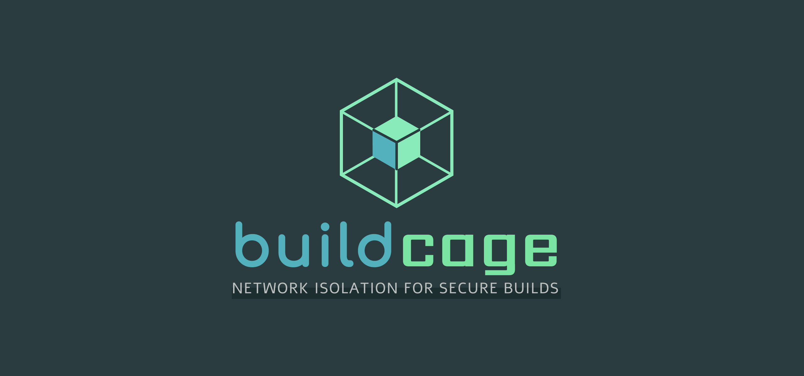
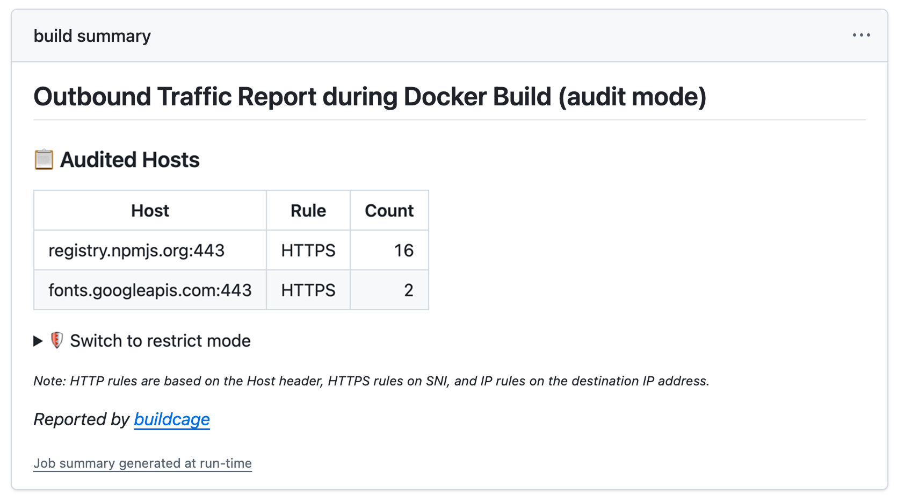
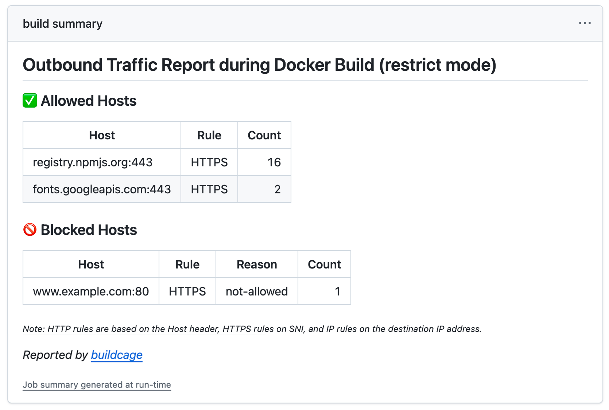

# buildcage




**A secure Docker build environment that prevents supply chain attacks by restricting outbound network access during image builds.**

buildcage is a Docker container that runs a custom BuildKit builder. When you configure Docker Buildx to use buildcage as a remote builder, all network traffic from `RUN` steps in your Dockerfile is routed through an internal proxy that can log and block connections based on domain name.

You define a list of allowed domains, and only connections to those domains are permitted during builds — everything else is blocked.

*Think of it as a firewall for your Docker builds.*

## Why Use buildcage?

When you run `RUN npm install` or `RUN apt-get install` in a Dockerfile, these commands can connect to any server on the internet. **You have no visibility or control over where they connect.**

buildcage solves this by restricting outbound network access during builds to only the domains you explicitly allow.


## How It Works

1. **You define allowed domains**

    ```yaml
    allowed_https_domains: registry.npmjs.org,github.com
    ```

2. **buildcage acts as a gatekeeper**
    - All outbound connections from `RUN` steps go through buildcage's proxy
    - Only requests to allowed domains pass through
    - Everything is logged

3. **Everything else is blocked**
    - Malicious packages cannot contact external servers
    - Your build logs show exactly what was blocked
    - The report step fails if blocked connections are detected, causing the workflow to fail

**Two modes available** (see [Usage with GitHub Actions](#usage-with-github-actions) for details):

- **Audit mode**: Records all network destinations during builds, useful for creating allowlists.
- **Restrict mode**: Allows access only to permitted domains, blocking everything else.

## Who Should Use This?

### Recommended for:

- **CI/CD pipelines pulling from public registries** — if your builds download packages from npm, PyPI, RubyGems, or other public sources, buildcage limits the blast radius of compromised packages
- **Builds that handle secrets** — if your Dockerfiles use build secrets, tokens, or credentials, buildcage prevents them from being exfiltrated to unauthorized servers
- **Teams that need network visibility** — if you need to know exactly which external services your builds contact, buildcage logs every outbound connection and can enforce an allowlist

### May not be necessary for:

- **Fully offline builds** — if your builds run in an air-gapped environment with no external network access
- **Internal-only registries** — if all dependencies come from vetted, internal repositories with no public package sources
- **No-dependency builds** — if your Dockerfile only copies files and never runs commands that fetch external resources

## Features

- 🔒 **Network isolation**: Isolates network access for each `RUN` step using CNI (Container Network Interface)
- 📊 **Detailed logging**: Complete visibility into all network connections during builds
- 🚀 **GitHub Actions support**: Available as a reusable action for CI/CD pipelines
- ✅ **Zero Dockerfile changes**: Works with existing Dockerfiles without modification
- 🔍 **Audit mode**: Discover dependencies before enforcing restrictions
- 🛡️ **Restrict mode**: Production-ready access control

## Quick Start

### Prerequisites

- Docker with BuildKit (buildx plugin)
- GitHub Actions runner with Docker support (for CI/CD usage)
- Docker Compose (for local usage)

### First-Time Setup (Recommended Workflow)

Using buildcage in GitHub Actions involves three workflow steps:

1. Start the buildcage container (runs BuildKit inside a network-controlled environment)
2. Configure Docker Buildx to use the buildcage container as a remote builder
3. Run your build as usual — your Dockerfile and build commands stay the same

#### Step 1: Discover what domains your build needs (Audit Mode)

```yaml
name: Discover Build Dependencies

on: [push]

jobs:
  audit:
    runs-on: ubuntu-latest
    steps:
      - uses: actions/checkout@v4

      - name: Start buildcage in audit mode
        id: buildcage
        uses: dash14/buildcage/setup@v1
        with:
          proxy_mode: audit  # Log everything, block nothing

      - name: Set up Docker Buildx
        uses: docker/setup-buildx-action@v3
        with:
          driver: remote
          endpoint: tcp://localhost:${{ steps.buildcage.outputs.port }}

      - name: Build and discover dependencies
        uses: docker/build-push-action@v6
        with:
          context: .
          push: false  # Set to true to push the built image

      - name: Show what domains were accessed
        if: always()
        uses: dash14/buildcage/report@v1
        with:
          fail_on_blocked: false  # Don't fail, just show the report
```

See the [complete example workflow](.github/workflows/example-audit.yml).

#### Step 2: Check the report

The report action outputs a Job Summary showing every domain your build contacted:



Copy these domain names into `allowed_https_domains` or `allowed_http_domains` for Step 3.

#### Step 3: Create your allowlist and switch to restrict mode

```yaml
name: Secure Build

on: [push]

jobs:
  build:
    runs-on: ubuntu-latest
    steps:
      - uses: actions/checkout@v4

      - name: Start buildcage in restrict mode
        id: buildcage
        uses: dash14/buildcage/setup@v1
        with:
          proxy_mode: restrict  # Block everything except allowed domains
          allowed_https_domains: >-
            registry.npmjs.org,
            fonts.googleapis.com

      - name: Set up Docker Buildx
        uses: docker/setup-buildx-action@v3
        with:
          driver: remote
          endpoint: tcp://localhost:${{ steps.buildcage.outputs.port }}

      - name: Build with protection
        uses: docker/build-push-action@v6
        with:
          context: .
          push: false  # Set to true to push the built image

      - name: Security report
        if: always()
        uses: dash14/buildcage/report@v1
        # Build fails if any unexpected connections were blocked
```

See the [complete example workflow](.github/workflows/example-restrict.yml).

Your builds are now protected. Any unexpected connections will be blocked and reported.

## Usage with GitHub Actions

### Setup Action

Starts the buildcage builder container.

```yaml
- name: Start buildcage builder
  id: buildcage
  uses: dash14/buildcage/setup@v1
  with:
    proxy_mode: restrict
    allowed_https_domains: registry.npmjs.org,github.com
```

#### Parameters

| Parameter | Required | Default | Description |
|-----------|----------|---------|-------------|
| `buildcage_image` | No | `ghcr.io/dash14/buildcage` | Docker image name |
| `buildcage_version` | No | `1` | Image tag |
| `proxy_mode` | No | `restrict` | Operation mode (`audit` / `restrict`) |
| `allowed_http_domains` | No | empty | Allowed HTTP domains (comma-separated, without port) |
| `allowed_https_domains` | No | empty | Allowed HTTPS domains (comma-separated, without port) |
| `port` | No | `1234` | BuildKit endpoint port on localhost |

#### Outputs

| Name | Description |
|------|-------------|
| `port` | BuildKit endpoint port |

Pass this port to [`docker/setup-buildx-action`](https://github.com/docker/setup-buildx-action) to use buildcage as a remote builder:

```yaml
- name: Set up Docker Buildx
  uses: docker/setup-buildx-action@v3
  with:
    driver: remote
    endpoint: tcp://localhost:${{ steps.buildcage.outputs.port }}
```

#### Operation Modes

##### Audit Mode (`proxy_mode: audit`)

**When to use:** First-time setup, adding new dependencies, or investigating issues.

**What it does:**
- Allows all HTTP/HTTPS connections
- Logs every domain accessed during the build
- Does NOT block anything

##### Restrict Mode (`proxy_mode: restrict`)

**When to use:** Production builds, CI/CD pipelines, security-critical environments.

**What it does:**
- Allows connections only to domains in `allowed_http_domains` / `allowed_https_domains`
- Blocks all other connections
- Logs allowed and blocked attempts

#### Tips

- Start with audit mode to discover required domains, then switch to restrict mode.
- Wildcard domains are supported (e.g., `*.github.com` matches all subdomains of `github.com`).
- Separate HTTP and HTTPS domains — some services use different hosts for each protocol.
- Common package registries often use multiple domains (e.g., PyPI uses both `pypi.org` and `files.pythonhosted.org`).
- Some package managers download over plain HTTP (e.g., certain Debian mirrors). Add those domains to `allowed_http_domains` separately:

  ```yaml
  allowed_http_domains: deb.debian.org
  allowed_https_domains: registry.npmjs.org
  ```

### Report Action

Displays communication logs after builds and optionally fails if any BLOCKED connections are found.

```yaml
- name: Show proxy report
  if: always()
  uses: dash14/buildcage/report@v1
```

#### Job Summary

**Audit mode:**


Use the domain names shown in the report to create your allowlist for restrict mode.

**Restrict mode:**



The report step fails if blocked connections are detected, causing the workflow to fail. You can disable this by setting `fail_on_blocked: false`.

#### Parameters

| Parameter | Required | Default | Description |
|-----------|----------|---------|-------------|
| `fail_on_blocked` | No | `true` | Fail the step if blocked connections are detected |

---

## Architecture

### For Technical Users

buildcage creates a controlled network environment for your Docker builds:

1. **BuildKit RUN steps run in isolated containers** connected to a private network (CNI)
2. **All DNS queries return the proxy IP** (172.20.0.1), forcing traffic through the proxy
3. **The proxy inspects each request:**
   - HTTPS: Reads the SNI (Server Name Indication) without decrypting
   - HTTP: Reads the Host header
4. **Allowlist check:** If the domain is allowed → connection proceeds. Otherwise → blocked.

**Note:** Base image pulls (`FROM` instructions) are performed by buildkitd itself, which runs outside the isolated network. Only commands in `RUN` steps are subject to network filtering.

**Why this approach?**
- No MITM certificate injection needed
- TLS certificate validation works normally
- Zero modification to your Dockerfile required
- Works with any programming language or package manager
- Cannot inspect encrypted HTTPS payload content (see [Security Considerations](#security-considerations))

### Architecture Diagram

```
┌──────────────────────────────────────────────────────────────────┐
│ Builder container (privileged, single container)                 │
│                                                                  │
│  ┌──────────────────────────┐                                    │
│  │ buildkitd (PID 1)        │──→ internet (image pull)           │
│  │ --oci-worker-net=cni     │                                    │
│  └──────────────────────────┘                                    │
│                                                                  │
│  ┌──────────────────────────┐  ┌──────────────────────────────┐  │
│  │ dnsmasq                  │  │ nginx                        │  │
│  │ all domains → 172.20.0.1 │  │ HTTP proxy (port 80)         │  │
│  │ port 53                  │  │ HTTPS stream proxy (port 443)│  │
│  └──────────────────────────┘  │ Allow/Block based on         │  │
│              ↑                 │   SNI (HTTPS) / Host (HTTP)  │  │
│              │ DNS             │          ↓                   │  │
│              │                 │ internet (allowed domains)   │  │
│              │                 └──────────────────────────────┘  │
│   ···········│·· buildkit0 bridge (172.20.0.1) ··················│
│              │                    ↑                              │
│  ┌───────────┴────────────────────┴────────┐                     │
│  │ RUN Step containers (CNI isolated-net)  │                     │
│  │ IP: 172.20.0.100 - 172.20.0.200         │                     │
│  │                                         │                     │
│  │ DNS → 172.20.0.1:53 (dnsmasq)           │                     │
│  │ HTTP/HTTPS → 172.20.0.1 (nginx)         │                     │
│  │ Other traffic → blocked (iptables)      │                     │
│  └─────────────────────────────────────────┘                     │
└──────────────────────────────────────────────────────────────────┘
```


All containers spawned by BuildKit `RUN` steps are placed on an isolated network (CNI). DNS queries are redirected to the proxy IP, and the proxy checks each request's SNI (HTTPS) or Host header (HTTP) against the allowlist before forwarding or blocking.

---

## Security Considerations

> **Important:** buildcage controls *where* your builds can connect, not *what code* they run. If a malicious package is delivered through a legitimate repository (e.g., a compromised npm package hosted on `registry.npmjs.org`), buildcage cannot detect or prevent it — the connection goes to an allowed domain.
>
> Do not rely on buildcage as your sole supply chain security measure. Use it as one layer in a defense-in-depth strategy — a last line of defense that limits the blast radius of compromised dependencies by restricting their ability to communicate with external servers.

### What buildcage protects against

buildcage blocks outbound connections to domains not on your allowlist during Docker builds. This helps mitigate scenarios such as:

- **Data exfiltration** — prevents build secrets (e.g., environment variables, tokens) from being sent to external servers
- **Command-and-control (C2) communication** — blocks compromised dependencies from phoning home to attacker-controlled servers
- **Unexpected telemetry** — stops analytics, tracking, or other undisclosed network calls that packages may make during installation

### Security Mechanisms

#### Direct IP Address Connections

All connections using direct IP addresses from within RUN steps (e.g., `curl http://1.2.3.4/`) are **blocked by iptables**. All outbound connections must go through the proxy via domain names.

This is intentional — it ensures all traffic can be inspected and logged.

#### DNS-Level Control

- **Full redirect**: Returns the proxy IP for all DNS queries.
- **HTTPS record rejection**: Filters DNS HTTPS (type 65) records to prevent Encrypted Client Hello (ECH), which could bypass SNI-based filtering.

#### HTTP/HTTPS Proxy Control

- **HTTPS**: Determines the target server name by reading the SNI field, without terminating TLS. Certificate validation is unaffected.
- **HTTP**: Domain determination via Host header.
- **Dynamic allowlist**: Controlled via environment variables.

#### Network Isolation

- **CNI configuration**: Places temporary containers from BuildKit RUN steps into isolated-net (buildkit0 bridge, 172.20.0.0/24).
- **iptables**: Drops all FORWARD from buildkit0, also blocks direct access to buildkitd API.
- **Gateway enforcement**: All traffic must go through the proxy on 172.20.0.1.

### Known Limitations

#### Domain Fronting

buildcage inspects the **SNI (Server Name Indication)** field in HTTPS connections but cannot decrypt the actual request content inside the TLS tunnel. This creates a potential bypass technique called "domain fronting."

**How it works:**

```
Attack flow:
1. ClientHello SNI: allowed.example.com  ← buildcage only sees this → ✅ allowed
2. HTTP Host header: malicious.example.com  ← encrypted, cannot be inspected
3. CDN routes based on Host header → reaches attacker's server
```

For this attack to succeed, the allowed domain and the attack target domain must reside on **the same CDN or hosting infrastructure**.

**Why we don't prevent this:**

To fully defend against domain fronting, the proxy would need to terminate TLS (MITM) and inspect HTTP contents. However, this presents significant challenges:

- **MITM CA certificate generation and management** — The proxy would need to generate TLS certificates for each domain on the fly.
- **CA certificate injection into build containers** — Build containers generated by BuildKit's OCI worker have independent filesystems, making it technically difficult to trust a MITM CA (would require modifications to buildkitd itself).
- **Interference with TLS validation** — Trusting a self-signed CA would affect normal TLS certificate validation within build containers.

Given these implementation costs versus the strict preconditions for the attack (the attacker's server must be on the same infrastructure as the allowed domain), this is treated as an **accepted risk**.

**Mitigation strategies:**

- **Keep allowed domains to a minimum** — Only specify the domains you need in `allowed_http_domains` / `allowed_https_domains`.
- **Be specific with allowed domains** — Avoid broad wildcard CDN domains (e.g., `*.cdn.example.com`) when possible.
- **Use service-specific domains** — Prefer `registry.npmjs.org` over generic CDN wildcard domains.
- **Major CDN countermeasures** — Major CDN providers like CloudFront and Cloudflare have already introduced measures to restrict domain fronting. Consult your CDN provider's documentation for current details.
- **Regular audits** — Periodically run in audit mode to detect anomalies in connection patterns.

---

## FAQ

**Q: Does this slow down my builds?**

A: Minimal impact. The proxy adds negligible latency (<1ms per request). DNS caching and connection pooling keep overhead low.

**Q: Can I use this with multi-stage builds?**

A: Yes! buildcage works seamlessly with multi-stage Dockerfiles.

**Q: Does this work with private package registries?**

A: Yes. Just add your private registry's domain to `allowed_https_domains`.

**Q: What happens if I forget to add a required domain?**

A: In restrict mode, the build will fail with a clear error message. Run in audit mode first to discover all required domains.

**Q: Can I use wildcards in domain names?**

A: Yes. Prefix wildcards like `*.example.com` are supported and will match all subdomains (e.g., `sub.example.com`, `deep.sub.example.com`). Note that `*.example.com` does not match `example.com` itself—add both if needed. Suffix wildcards (e.g., `example.*`) are not supported.

**Q: Do I need to clean up the buildcage container?**

A: No. The container is automatically removed when the GitHub Actions job completes.

**Q: Does this protect against malicious code execution?**

A: No. buildcage only controls network access. It doesn't prevent malicious code from running—it prevents that code from communicating with external servers.

## Troubleshooting

If you encounter issues, try reproducing the problem locally to get detailed logs:

1. **Check logs:**
   ```bash
   docker compose logs builder
   ```

2. **Run in audit mode** to understand your build's network behavior:
   ```bash
   make clean
   make run_audit_mode
   docker buildx build --builder buildcage --no-cache -f Dockerfile .
   docker compose logs builder
   ```

3. **Open an issue** at [github.com/dash14/buildcage/issues](https://github.com/dash14/buildcage/issues) with:
   - Your Dockerfile
   - The audit mode report output
   - Full error messages from `docker compose logs builder`

## Development

### Testing

```bash
# Audit mode test (start → build → verify → clean up)
make test_audit_mode

# Restrict mode test (start → build → verify → clean up)
make test_restrict_mode
```

### Viewing Logs

```bash
# All communication logs
docker compose logs builder

# Real-time log monitoring
docker compose logs -f builder
```

**Log format:**

```
[28/Jan/2026:10:15:30 +0000] [ALLOWED] TCP 200 1234 5678 0.123 "github.com:443"
[28/Jan/2026:10:15:31 +0000] [BLOCKED] TCP 502 0 0 0.001 "malicious.com:443"
[28/Jan/2026:10:15:32 +0000] [AUDIT] HTTP 200 2345 6789 0.234 "npmjs.org:80"
```

Fields: `[timestamp] [status] protocol http_status bytes_sent bytes_received duration "domain:port"`

### Makefile Commands

| Command | Description |
|---------|-------------|
| `make help` | Show available commands |
| `make run_audit_mode` | Start in audit mode |
| `make run_restrict_mode` | Start in restrict mode (default domains) |
| `make test_audit_mode` | Run audit mode tests (start → build → verify → clean up) |
| `make test_restrict_mode` | Run restrict mode tests (start → build → verify → clean up) |
| `make clean` | Remove all resources |

### Directory Structure

```
.
├── setup/
│   ├── action.yml             # GitHub Action: dash14/buildcage/setup@v1
│   └── compose.yml            # Compose config for GitHub Actions (with image tag)
├── report/
│   ├── action.yml             # GitHub Action: dash14/buildcage/report@v1
│   └── main.mjs               # Log analysis and Job Summary output
├── compose.yml                # Docker Compose config
├── compose.test.yml           # Test override config
├── Makefile                   # Operational commands
├── docker/
│   ├── Dockerfile             # Multi-stage BuildKit + nginx + dnsmasq
│   └── files/                 # Builder container config files
│       ├── entrypoint.sh      # iptables/dnsmasq/nginx/buildkitd startup
│       ├── buildkitd.toml     # BuildKit config
│       ├── cni.conflist       # CNI config (isolated-net)
│       ├── dnsmasq.conf       # DNS config (all domains → gateway)
│       └── nginx.conf.template # Dynamic nginx config (HTTP/HTTPS)
└── test/
    ├── Dockerfile.audit       # Audit mode test
    ├── Dockerfile.restrict    # Restrict mode test
    ├── assert-audit-mode.sh   # Audit mode verification script
    ├── assert-restrict-mode.sh # Restrict mode verification script
    ├── helpers.sh             # Test helpers
    ├── test-server/           # Test HTTP server
    └── test-dns/              # Test DNS server
```

### Local Usage (without GitHub Actions)

GitHub Actions inputs use lowercase names (e.g., `proxy_mode`), while environment variables for local/Docker Compose usage use uppercase (e.g., `PROXY_MODE`).

#### Starting the Builder

**Audit mode** (log all connections):

```bash
make run_audit_mode
```

**Restrict mode** (allowlist-based):

```bash
make run_restrict_mode
```

**Start with custom domains**:

```bash
ALLOWED_HTTPS_DOMAINS="github.com,npmjs.org,example.com" make run_restrict_mode
```

#### End-to-End Local Workflow

```bash
# 1. Start buildcage
make run_audit_mode

# 2. Build
docker buildx build --builder buildcage --progress=plain -f Dockerfile .

# 3. View report
docker compose logs builder

# 4. Clean up
make clean
```

## Contributing

Contributions are welcome! Please feel free to submit issues or pull requests.

## License
Licensed under the MIT License.
See [LICENSE](./LICENSE) file for more details.

## Acknowledgments

buildcage is built on top of:
- [BuildKit](https://github.com/moby/buildkit) - Modern build toolkit
- [nginx](https://nginx.org/) - HTTP proxy
- [dnsmasq](https://thekelleys.org.uk/dnsmasq/doc.html) - DNS server
- [CNI](https://github.com/containernetworking/cni) - Container network interface
