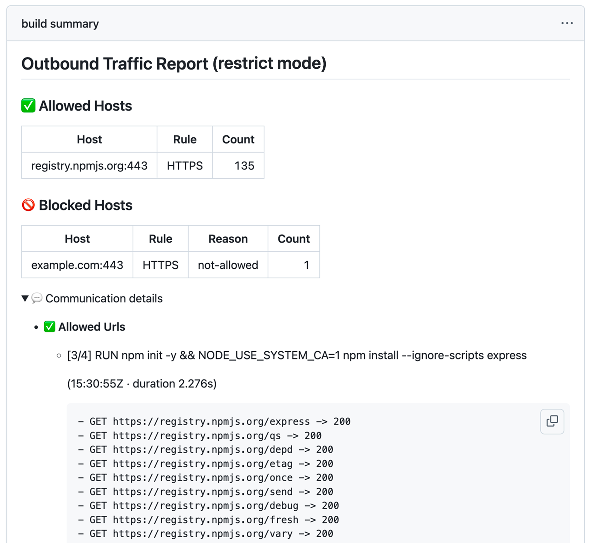

# Explicit Proxy Engine (deprecated)

> [!WARNING]
> `explicit` is **deprecated**. It still works and existing workflows keep running, but it receives
> no further development. If you chose it to see full URL paths in the report, use
> [`inspect`](../README.md#engines) instead: it enforces on the method and the path as well, and it
> sees every tool rather than only the ones that respect `HTTP_PROXY`/`HTTPS_PROXY`.

`proxy_engine` selects how Buildcage intercepts and enforces traffic. It is independent of
`proxy_mode`: either engine works with either mode, and both use the same
[rule syntax](../README.md#rule-syntax).

- **`universal`** (default; `transparent` is accepted as an alias): traffic is intercepted at the
  network level, with no proxy configuration or CA trust needed inside the build
- **`explicit`**: BuildKit's native `--proxy-network` — injects `HTTP_PROXY`/`HTTPS_PROXY` and a CA
  certificate, then MITMs the traffic to inspect requests directly

That interception is entirely BuildKit's own feature. buildkitd generates the CA, injects it into
the step along with the proxy variables, and runs the proxy that terminates TLS — Buildcage neither
implements nor operates it, never holds the CA private key, and no build traffic passes through
Buildcage's own code. Buildcage's only part is compiling your `allowed_*_rules` into a BuildKit
[source policy](https://github.com/moby/buildkit/blob/master/docs/proxy.md) and attaching it to the
build request.

```yaml
- name: Start Buildcage
  uses: buildcage/docker@9db933f44e0dd4821ad7eea6f58f3b7bfd2f2db5 # v3.1.6
  with:
    proxy_engine: explicit
    proxy_mode: restrict
    allowed_https_rules: |
      registry.npmjs.org:443
```

Everything else in the workflow is unchanged — see the
[complete example workflow](../.github/workflows/example-explicit.yml).

## Comparison

|                                                                    | `universal` (default)                                                       | `explicit`                                                                                                                                                                                                                                 |
| ------------------------------------------------------------------ | --------------------------------------------------------------------------- | ------------------------------------------------------------------------------------------------------------------------------------------------------------------------------------------------------------------------------------------ |
| Isolation mechanism                                                | CNI network + DNS redirection                                               | BuildKit native `--proxy-network` — each `RUN` step gets its own network whose only reachable peer is BuildKit's proxy                                                                                                                     |
| TLS handling                                                       | Not terminated — SNI (HTTPS) / Host header (HTTP) inspected only            | Terminated (MITM) via an injected CA — full host **and path** visible                                                                                                                                                                      |
| Dockerfile / tool changes                                          | None required                                                               | None for tools that respect `HTTP_PROXY`/`HTTPS_PROXY` and trust the system CA store; a tool bundling its own CA store (e.g. npm) needs a flag pointing it at the system one — see [CA trust](#ca-trust-for-tools-with-their-own-ca-store) |
| Enforcement granularity                                            | Domain (and port)                                                           | Domain (and port) — see [What the report shows](#what-the-report-shows)                                                                                                                                                                    |
| `allowed_ip_rules` enforcement                                     | Raw TCP passthrough — no protocol inspection once `ip:port` matches         | Same as domain rules — matched via the BuildKit source policy, not a special-cased passthrough                                                                                                                                             |
| Non-cooperative tools (ignore proxy env vars, or open raw sockets) | Still observed, blocked, and logged — network-level enforcement, no opt-out | Blocked with "network unreachable" — invisible, no trace anywhere in the report                                                                                                                                                            |
| Report detail                                                      | Allowed / blocked hosts                                                     | Allowed / blocked hosts (with full path), plus a per-step "Communication details" breakdown                                                                                                                                                |
| BuildKit provenance / SLSA integration                             | Not integrated                                                              | Integrated into BuildKit's own build output and SLSA provenance                                                                                                                                                                            |
| Best for                                                           | Default choice — works with any tool regardless of proxy-awareness          | Cooperative tools, when path-level visibility or provenance integration matters more than catching non-cooperative traffic                                                                                                                 |

`universal` enforces at the network layer whether or not a tool cooperates, so every connection
attempt is observed and recorded — this is why it is the default. Use `explicit` when you need
URL/path-level visibility in BuildKit's own build output and SLSA provenance, and your build's tools
are known to respect `HTTP_PROXY`/`HTTPS_PROXY`.

## What the report shows

Because TLS is terminated, the report carries the full URL of every request — not just the host —
and groups them under the `RUN` step that made them:



The path is **visibility only**. `allowed_https_rules` / `allowed_http_rules` / `allowed_ip_rules`
have no path component, so the allow/deny decision is still made on `host:port` alone: the rule
`registry.npmjs.org:443` above permits every path on that host, and each one is logged individually
rather than being matched against anything. Enforcement granularity is therefore identical to
`universal` — what changes is how much you can see afterwards.

## CA trust for tools with their own CA store

Under `proxy_engine: explicit`, BuildKit injects its generated CA into the container's system CA
bundle, so tools that consult that file the normal way (most tools built on OpenSSL — `curl`, `git`,
Go binaries) already trust it with no configuration. A tool that bundles its own separate CA store
ignores that file and still fails with a TLS/certificate error, even though the proxy variables are
set correctly.

**npm** is the common case — point it at the system CA store BuildKit already patched, either inline
on the command that needs it:

```dockerfile
RUN NODE_USE_SYSTEM_CA=1 npm install
```

or once per stage if it runs npm more than once:

```dockerfile
FROM node:22-alpine
ARG NODE_USE_SYSTEM_CA=1
RUN npm install
RUN npm run build
```

If a different tool fails the same way — a `RUN` step that works under `universal` but fails with a
TLS/certificate error under `explicit` — check that tool's documentation for an equivalent setting.

## Further reading

- [Explicit Proxy Engine](./security.md#explicit-proxy-engine) in Security Details — architecture,
  source-policy compilation, and coverage/visibility limits
- [Explicit Engine Internals](./development.md#explicit-engine-internals) in the Development Guide —
  the supervisor binary, gRPC interception, and policy compilation
