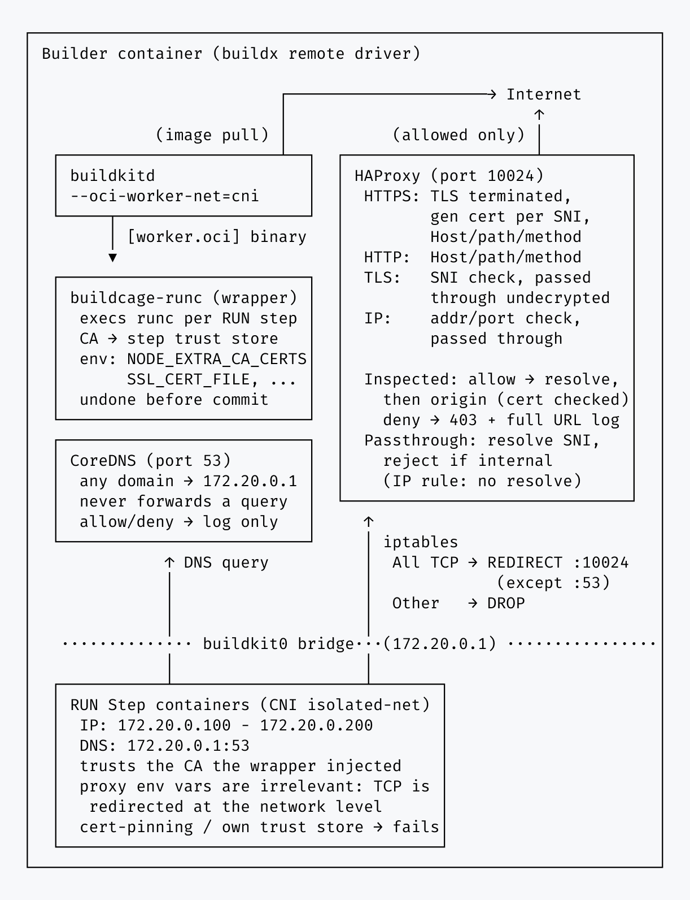

# Inspect Proxy Engine (experimental)

> [!WARNING]
> `inspect` is an **experimental** engine. It terminates TLS inside the cage, so a tool that pins a
> certificate or ships its own trust store will not work under it. Read this page before relying on
> it. `universal` remains the default and recommended engine.

`inspect` terminates TLS inside the cage and re-signs it with a CA the build is made to trust. That
is what lets it enforce on the method, path and query of a request rather than only on its
destination.

|                     | `universal` (default) | `inspect`                     |
| ------------------- | --------------------- | ----------------------------- |
| Interception        | network level         | network level                 |
| Visible to policy   | destination           | method, full URL, path, query |
| CA trusted by build | not needed            | **required**                  |

Nothing about `universal` changes when this engine is used, and it stays the default. The
deprecated [`explicit`](./explicit-engine.md) engine is unaffected.

```yaml
- name: Start Buildcage
  uses: buildcage/docker@cd96c2d0d25598e9d92550490b0b39128d14e189 # v3.1.1
  with:
    proxy_mode: restrict
    proxy_engine: inspect
    allowed_url_rules: |
      GET|HEAD https://registry.npmjs.org/**
```

## Why this engine exists

Domain-level rules cannot separate fetching a package from publishing one. A build allowed to reach
a package registry to install dependencies is, under a host rule, equally allowed to publish to it
with a stolen token. Enforcing on the method and the path requires seeing inside the request, which
requires terminating TLS.

## Scope

Like `universal`, this engine governs `RUN` step traffic: its iptables rule redirects only what
arrives on the CNI bridge (`-i buildkit0`, the `RUN` step side).

`FROM` (`docker-image://`) is not governed — buildkitd's own egress is left alone, and the engine
carries no BuildKit source policy at all.

## Architecture



Two components, plus a wrapper around runc.

**HAProxy** does the inspecting, and the engine depends on three of its behaviours:

1. **It tells a TLS handshake from a plain request by its first bytes** (`req.ssl_hello_type`), so
   one listener takes both and no port has to be declared as plaintext or TLS in advance. That is
   what lets an audit run record everything without being configured for it first.
2. **It resolves the requested name itself and connects there**, only once a request has already
   passed the rules (`do-resolve` then `set-dst`), so where a connection ends up is never the
   client's choice, and a name a request would be refused for never triggers a real DNS query.
3. **It resolves `..` in the path before the rules see it** (`normalize-uri`), so a rule cannot be
   walked out of.

**CoreDNS** never resolves a name for real, allowed or not; it only decides what gets logged as
allowed or denied, which still has to match the rules exactly, on a regex rather than a domain
suffix; see [DNS](#dns).

**`buildkit-runc`** is a wrapper standing in front of the real runc, selected with
`[worker.oci] binary` in `buildkitd.toml`. For the subcommands that carry a bundle it makes the step
trust the proxy's CA, runs the real runc, then undoes that before BuildKit commits the snapshot.
Injection never touches LLB and happens at exec time, so it cannot affect a cache key.

## Rule syntax

A rule is a method list, a space, then a URL pattern. Because a rule contains a space, this input is
newline separated.

```yaml
allowed_url_rules: |
  GET https://registry.npmjs.org/@myorg/**
  GET|HEAD https://example.com/public/*
  POST,PUT https://api.internal.example.com/v1/*
  * https://internal.example.com
```

Methods are separated by `|` or `,`, and `*` means any method. **The method is required.** There is
no default, so a rule always states what it permits and nobody has to guess what omitting it means.

| Pattern | In a domain                 | In a path              |
| ------- | --------------------------- | ---------------------- |
| `**`    | crosses dots                | crosses `/`            |
| `*`     | one or more characters      | one or more characters |
| `?`     | one character               | one character          |
| `~`     | raw regex for the whole URL |                        |

**A wildcard may sit among literal text here**, in a path segment as in a domain label:
`abc*.amazonaws.com`, `/pkg-*/**`. The other engines require a label containing `*` to be exactly
`*` or `**`, and for them that is only a restriction on phrasing. For `inspect` it would be a
hazard, because an author who cannot write `abc*` has to widen the rule to `*.amazonaws.com`
instead — and CoreDNS's allow/deny decision is generated from the same host pattern the HTTP rule
is, so a wider host is a wider grant on both sides at once, not just a less precise log line. The
grammar lives in its own compiler, so relaxing it cannot change what the other engines accept.

**A path or method never narrows what a wildcard host resolves.** DNS has no notion of a path: a
rule of `GET https://*.example.com/release/**` still makes CoreDNS log any name under
`*.example.com` as allowed, `SECRET-DATA.example.com` included, because the allow/deny decision is
host-only by construction — the path is only enforced afterward, by HAProxy. This is not a gap: it
is exactly why CoreDNS never resolves anything for real (see [DNS](#dns)) — the query itself cannot
leak a path that was never sent, and the request that follows is refused all the same, before it
ever reaches an origin. Writing the host half as narrowly as the name actually needs is what
narrows the DNS-layer exposure; the path half narrows only the HTTP-layer one.

`allowed_https_rules` and `allowed_http_rules` keep their existing `host:port` syntax and meaning,
and are equivalent to a URL rule with any method and any path.

A rule may name an address rather than a name, in `allowed_url_rules` or the host rules. The proxy
resolves the Host header to decide where to connect, and no resolver can answer an address, so one
is taken as it stands instead of being asked about. Nothing is loosened by that: the rules are
matched against the same Host header and still decide, and what the client connected to is discarded
either way. The pattern is strict about its octets, because whatever it admits is used unresolved;
`999.1.2.3`, `010.0.0.1` and `1.2.3.4.evil.example` all fail it and are refused.

Unlike `allowed_ip_rules`, which tunnels without looking, an address reached this way stays
inspected, so method and path rules apply to it. Over HTTPS the origin's certificate still has to be
valid for the address, which means an IP SAN; most are not, so an address is usually a plaintext or
a passthrough destination in practice.

`allow_tls_rules` takes the same `host:port` syntax and covers TLS that is not HTTPS: the SNI and
the destination port are checked and the connection is passed through undecrypted, so the build
validates the origin's own certificate. The name is still resolved here, so a passthrough goes where
we resolved it and not where the client aimed. `allowed_ip_rules` covers the same for a destination with no name at all.

## How a request is handled

```
                        ┌─────────────────────────────────────────┐
   build ──redirect──▶  │ detect (mode tcp)                       │
                        │   first bytes: handshake or plain?      │
                        └───┬──────────────┬──────────────┬───────┘
                            │              │              │
              ip/tls rule   │      TLS     │    plaintext │
                            ▼              ▼              ▼
                     ┌────────────┐  ┌──────────┐  ┌──────────┐
                     │ passthrough│  │ https_in │  │ http_in  │
                     │  mode tcp  │  │ TLS ter- │  │          │
                     │  undecryp- │  │ minated, │  │          │
                     │  ted       │  │ cert per │  │          │
                     └─────┬──────┘  │ SNI      │  └────┬─────┘
                           │         └────┬─────┘       │
                           │              │             │
                           │      normalize the path    │
                           │      resolve the name here │
                           │      match host/path/method│
                           │              │             │
                           ▼              ▼             ▼
                        origin      origin (TLS,   origin
                                    cert checked)
```

A certificate is generated from the SNI alone, so **a refused destination is never contacted**: the
only path that reaches an origin is the backend, and a request that no rule allows never gets there.
The origin's certificate is checked on that same connection, which is why the check applies exactly
where it matters.

## Expected behaviour

Everything below was verified against HAProxy rather than reasoned about.

### Per rule kind

| Rule                  | What it permits                            | Decided by           | Decrypted |
| --------------------- | ------------------------------------------ | -------------------- | --------- |
| `allowed_https_rules` | any method and path on the host, over TLS  | Host header          | yes       |
| `allowed_http_rules`  | any method and path on the host, plaintext | Host header          | n/a       |
| `allowed_url_rules`   | the named methods on matching URLs         | Host header and path | yes       |
| `allow_tls_rules`     | TLS to the named host and port             | SNI and port         | **no**    |
| `allowed_ip_rules`    | TCP to the address and port, any protocol  | address and port     | **no**    |

### Attempts to get around the rules

| What the build does                                    | What happens                                                                                                             |
| ------------------------------------------------------ | ------------------------------------------------------------------------------------------------------------------------ |
| Asks for any name, on or off the allowlist             | Answered locally with the proxy's own address; the query is never forwarded, allowed or not                              |
| Requests a host no rule covers                         | **403**, recorded with its full URL, origin never contacted                                                              |
| Requests a path or method no rule covers               | **403**, recorded with its full URL                                                                                      |
| Walks out of an allowed path with `..`                 | **403**: the path is normalised before the rules see it                                                                  |
| Encodes the traversal as `%2e%2e` or `..%2f`           | **403**: decoding happens first, and what no normaliser can strip is refused outright                                    |
| Uses a backslash, raw or `%5c`, to climb               | **403**: the URL standard treats `\` as `/` for http(s), so a raw backslash is refused outright and `..%5c` like `..%2f` |
| Sends an allowed name while aiming elsewhere           | Reaches the address **we** resolved, not the one it chose                                                                |
| Puts an address in the Host header                     | Taken as the destination only if a rule names it; the rules decide either way                                            |
| Points `/etc/hosts` at an address of its choosing      | Same: the client's address is discarded                                                                                  |
| Allowlists a name that resolves to an internal address | **403**: the resolved address is refused if it is loopback, link-local, the proxy itself, or another never-public range  |
| Reaches an allowed host presenting a wrong certificate | **503**: the origin certificate is checked when HAProxy connects                                                         |
| Speaks a protocol that is not TLS on any port          | Classified by its first bytes, so it is parsed as HTTP if it is HTTP                                                     |
| Ignores the proxy variables entirely                   | No effect: interception is at the network level                                                                          |

Destination spoofing is **removed rather than detected**. HAProxy discards the address the client
picked and connects to the one it resolved itself, so there is no mismatch to catch and a legitimate
request still works.

### Audit mode

`proxy_mode: audit` records without enforcing: the rule ACLs are not emitted, so nothing is refused
on either listener, while the method and full URL of every request are still recorded. `set-dst` and
the origin certificate check stay in place, because neither can be dropped honestly.

Because one listener classifies by content, **audit needs no configuration to record everything**,
including plaintext on a port nobody declared. That is the point of the engine: a build's traffic
can be learned before any rule is written.

**The resolver still answers every query locally, even under audit.** It never forwards, in either
mode; forwarding would make it a live exfiltration channel for any name a build only looks up, never
connecting to. Audit's own let-everything-through policy is HAProxy's job: with no ACL to deny it,
`do-resolve` runs for every request and reaches the real address directly, so the mode whose whole
purpose is to observe real traffic still does. Every query CoreDNS sees is still logged as allowed,
so a name that was only looked up still appears in the report.

**Audit is not a passive observer.** TLS is still terminated, so a tool that pins a certificate, or
that consults a trust store the wrapper cannot reach, fails under `audit` exactly as under
`restrict`. That differs from `universal`, whose audit mode inspects nothing and breaks nothing.

### The resolved address, not just the name

The rules check the name; nothing about the name says where it resolves. An attacker who controls DNS
for an allowlisted domain, or a dependency's own domain that has been pointed inward, can make an
allowed name resolve to an internal address. The build itself cannot reach that address (it resolves
the same name inside its own netns), but the **proxy** connecting on its behalf sits on the builder
with whatever the runner can see. The loudest case is a cloud metadata endpoint at `169.254.169.254`
handing back credentials.

So a **resolved** destination is refused if it lands in a range that is never a legitimate public
origin: loopback, link-local (all of AWS/GCP/Azure IMDS), CGNAT (Alibaba IMDS), the IETF protocol
block (Oracle IMDS), their IPv6 equivalents, and the proxy's own address. An allowlisted name
pointing at `169.254.169.254` is refused with 403, before anything connects to it.

RFC1918 is deliberately **not** in that set: a name pointing at an internal mirror is a real, intended
setup. To reach one of these ranges on purpose, name the **address** in a rule rather than a name that
resolves to it. An explicitly named address is exempt, having been asked for rather than arrived at.

## Network isolation

The boundary is the network layout, not the proxy configuration.

- A CNI bridge (`buildkit0`, `172.20.0.0/24`) puts every `RUN` step on its own veth, with the
  builder container as the gateway.
- **All TCP is redirected to the single listener.** Nothing has to be declared as plaintext or TLS.
- Only the listener and the resolver are reachable on the gateway; everything else is dropped.
- `FORWARD` from the bridge is dropped, so a packet that escaped redirection goes nowhere. Only TCP
  is redirected, so this is also what stops UDP and ICMP: a build has no way out over either.
- CNI's `ipMasq` is off: nothing should be routed out, so there is nothing to masquerade.

Traffic between two concurrent `RUN` steps on the same bridge is switched at layer 2 and does not
traverse `FORWARD`. Both endpoints are inside the cage, so this is not an egress path, and
`universal` has the same property.

## DNS

**Every name is answered locally with the proxy's own address, allowed or not.** CoreDNS never
forwards a query anywhere: a build can exfiltrate through the query itself
(`SECRET-DATA.amazonaws.com` would reach an attacker's own authoritative nameserver the moment it is
forwarded, no connection ever needed), and closing that off unconditionally is simpler, and safer,
than closing it off only for the names a rule happens to deny. All the resolver decides is what gets
logged as `allowed` or `denied`, which still has to match the rules exactly, on a regex rather than a
domain suffix — dnsmasq can only express `/amazonaws.com/`, which covers everything beneath it, so a
rule of `abc*.amazonaws.com` would be logged as allowed for names it never meant to grant. That
precision is why this engine uses **CoreDNS**. `universal` is unaffected and keeps dnsmasq.

```
# Allowlisted names are logged as allowed, but answered exactly like a denied
# one below: this resolver never gets a request any closer to a real address.
. {
    view allowlist {
      expr name() matches '^(abc[^.]*\\.amazonaws\\.com|registry\\.npmjs\\.org)\\.$'
    }
    template IN A   { answer "{{ .Name }} 60 IN A <proxy-ip>" }
    template IN AAAA { }
    log . "buildcage dns allowed name={name}"
}

# Everything else: the same answer, logged as denied instead.
. {
    template IN A   { answer "{{ .Name }} 60 IN A <proxy-ip>" }
    template IN AAAA { }
    log . "buildcage dns denied name={name}"
}
```

The query never leaves either way, so the exfiltration channel stays shut regardless of how wide a
rule turns out to be — a name outside the allowlist is **answered locally with the proxy's own
address**, not NXDOMAIN, so the build connects there and the full URL including its query string is
recorded before the request is decided on. NXDOMAIN would close the channel just as well but leave
only a bare name in the log.

**Real resolution happens exactly once, in HAProxy, strictly after a request has already passed the
full rule check** (host, path and method) — never through CoreDNS, and never before that check. This
ordering is a security invariant, not an optimisation: getting it backwards would make HAProxy's own
`do-resolve` a live exfiltration channel of exactly the kind CoreDNS was built to avoid being, for
any request the rules were always going to refuse. It is also why a wildcard host is never made safer
by pairing it with a path or method restriction: DNS has no notion of a path, so `SECRET-DATA` under
an allowed `*.example.com` is logged as allowed the moment it is looked up, before any path is even
known — see [Rule syntax](#rule-syntax). The request that follows is still refused, and still never
reaches an origin; only the log line, not the outcome, reflects the host-only nature of this
resolver's decision.

## What the report reads

The `report` action reads **two** logs, not one.

| Log                        | What only it holds                                               |
| -------------------------- | ---------------------------------------------------------------- |
| `/var/log/haproxy/current` | Every request, with its method, full URL, status and size        |
| `/var/log/coredns/current` | Names the resolver refused, which never reached the proxy at all |

Leaving the resolver's log out would let a build exfiltrate through a DNS query alone and have the
report show nothing, since no connection is ever made in that case.

Refused requests carry their full URL, which is what this engine has and the others do not: the
request is read before it is decided on, and the origin is never contacted. A blocked entry
therefore names the exact URL that was attempted, query string included, rather than a bare host.

### One timeline

Everything the build did appears in order, refusals interleaved with the rest. The `explicit` engine
separates the two because its allowed requests can be attributed to a RUN step and its refusals
cannot; here nothing can, so splitting would only scatter a sequence that reads better whole.

```
✅ 00:00.512: GET https://registry.npmjs.org/express -> 200 (99.9KB)
🚫 00:01.048: DNS secret-data.attacker.example -> dns-not-allowed
🚫 00:01.390: POST https://registry.npmjs.org/express/-rev/1-abc -> not-allowed
✅ 00:02.115: TLS db.example.com:5432 -> (12.3KB)
🚫 00:02.601: GET https://absent.example.com/ -> dns-failed
```

Every time is relative to when the proxy itself started, not an absolute clock reading: `MM:SS.mmm`,
widening to `HH:MM:SS.mmm` only once a run passes an hour.

A refusal names its reason rather than a status: 403, 502 and 503 mean a rule, a name that would not
resolve, and an origin that could not be reached or verified, and the number does not say which.

An undecrypted passthrough is here too, with the byte count and nothing else, because that is all
there is to know about it. Without it the traffic a build was explicitly allowed to tunnel would be
the only thing the report could not show.

Names that merely resolved are left out. The request that followed already says the name resolved,
and listing both doubles every line. The traffic artifact keeps them, see below.

The proxy prints one guaranteed line at startup. An empty log is otherwise ambiguous between "saw
nothing" and "never ran", and reporting "nothing was blocked" for a proxy that never started is the
dangerous reading of the two.

### When the log is too large for the summary

GitHub caps a Job Summary at 1 MiB per step and, if a write exceeds that, drops the **entire**
step's summary rather than truncating it — the report would otherwise vanish instead of degrading.
Everything in the report besides Communication details is small and fixed in size, so if the full
list would push the summary over that limit, only this section is cut, at a line boundary, closing
off any code block left open by the cut. A note takes the place of what was removed, pointing at the
traffic artifact when `upload_traffic_artifact` was set, or suggesting it when it wasn't. The console
log (the workflow run's own logs, not the summary) is never truncated, since it carries no such limit.

### Traffic artifact

`upload_traffic_artifact: true` has `report` upload a JSON artifact named `buildcage-traffic`: an
array of everything above, oldest first, and name lookups that merely resolved as well. This one is
read by machines, where the volume costs nothing and a name resolved but never connected to is how a
too-wide rule being probed shows up.

| Field      | Always | Notes                                                  |
| ---------- | ------ | ------------------------------------------------------ |
| `time`     | yes    | ISO 8601 UTC                                           |
| `elapsed`  |        | since the proxy started, fixed `HH:MM:SS.mmm`          |
| `action`   | yes    | `allow`, `block`, or `audit` when nothing was enforced |
| `protocol` | yes    | `https`, `http`, `tls`, `tcp`, `dns`                   |
| `host`     | yes    | the name asked for, or the address when there was none |
| `port`     |        | absent for `dns`, which connects to nothing            |
| `method`   |        | `http` and `https` only                                |
| `url`      |        | `http` and `https` only                                |
| `status`   |        | only when something answered                           |
| `bytes`    |        | absent for a refusal and for `dns`                     |
| `reason`   |        | only when `action` is `block`                          |

**A field is absent because it does not apply, never because it was zero.** A refusal has no status
because nothing answered, and a passthrough none because nothing was decrypted. Filter on `action`.
`elapsed` is the one exception tied to the whole run rather than to one event: it is absent on every
record when the proxy's own start time could not be determined, rather than measured against
something else and presented as if it meant "since start".

`action: "audit"` rather than `allow` in audit mode: no allow decision was made, and claiming one
would misrepresent a run that enforced nothing.

The other engines never see a method or a URL, so this artifact carries no such detail for them —
`upload_traffic_artifact` only does anything for `proxy_engine: inspect`.

```yaml
- uses: buildcage/docker/report@v2
  with:
    upload_traffic_artifact: true
    traffic_artifact_retention_days: 30

# A later job, or a later run entirely via the API/gh CLI — an artifact
# outlives the step that made it, unlike a job output a step must be written
# in advance to read.
- uses: actions/download-artifact@v8
  with:
    name: buildcage-traffic
- run: jq '[.[] | select(.action == "block")]' buildcage-traffic/traffic.json
```

The artifact is uploaded even when the report fails the job, since a failing run is when it is most
wanted.

## From audit to restrict

An `audit` report ends with the `allowed_url_rules` that would have permitted exactly what the build
did, ready to paste into a `restrict` run. Generating them is the engine's reason for existing: a
developer cannot know in advance which URLs `npm install` reaches, so the rules have to be learned
from a real build.

A real `npm install express`, audited, produces this:

```yaml
allowed_url_rules: |
  GET https://registry.npmjs.org/**
  POST https://registry.npmjs.org/-/npm/v1/security/advisories/bulk
```

Which is the whole argument for the engine in three lines. npm does POST to the registry, for the
advisory check. `allowed_https_rules: registry.npmjs.org:443` permits that POST and every other one
on the same host, publishing included; these rules permit the one endpoint npm actually used.

A generated rule must never permit more than was observed, so:

- **Hosts are enumerated, never generalised.** `a.example.com` and `b.example.com` never become
  `*.example.com`. HAProxy's own rule check is generated from these same patterns, so a widened host
  is a wider grant there too, not only a less precise one in the DNS log.
- **Methods are listed exactly**, never `*`.
- **A path keeps its longest unchanging prefix**, and only what varied becomes `**`. A single
  observed path stays exact.

Grouping is by origin and method before paths are compared, so a path only a `POST` reached cannot
become reachable by `GET`. Groups that end up with the same pattern are merged back into one rule,
which is what keeps `GET|HEAD` on one line.

A host reached at many unrelated paths therefore collapses to `/**`. That is the honest answer: the
alternatives are listing every URL, which nobody can maintain, or clustering them, which invents
permissions nobody observed. Such a rule still constrains the method, which no host-level rule can.

The rules are a starting point, not an answer. A URL carrying a version or a date will not match the
next run, and anything reached through `allow_tls_rules` or `allowed_ip_rules` is absent, having
never been inspected. `make test_integration_buildkit_inspect_roundtrip` runs an audit build, feeds
its own generated rules back as `restrict`, and checks both halves: that every request still passes,
and that a path, method, host or port the build never used is refused.

A `~` regex rule cannot be split into a host and a path, so it cannot be matched by an engine that
matches the two separately. The generator warns and emits nothing for it; such a rule needs an
`allowed_https_rules` entry for the host it targets.

## No SLSA provenance, unlike `explicit`

BuildKit's own `--proxy-network` (used by `explicit`) records every URL it fetched, with a digest,
as a SLSA provenance material. This engine does not use it, so that is lost, and there is no way to
put it back without modifying BuildKit: the provenance predicate is built from an internal capture
that only BuildKit's own ops populate, with no external input path, and a frontend cannot attach its
own attestation under that same predicate either.

Buildcage can still publish what it observed by other means, for example as a separate attestation
attached after the build, or as the JSON traffic artifact described above. Those carry URL, method,
status and size, but no content digest, so such a list is an observation record and not a set of
integrity-bound materials.

## Limitations

- **TLS is terminated.** A tool that ships its own trust store, or that pins a certificate, will not
  work. The wrapper points the common CA-trust environment variables (below) at a store carrying the
  CA, but a tool that consults none of them cannot be reached. The JVM (Java, Kotlin, Scala, ...) is
  one such case: it only reads its own `cacerts` file, which nothing here points anywhere, so it is
  not supported yet.
- **No system CA store: every variable still gets set, but only to a file that trusts the proxy's
  own CA — not a passthrough connection's real certificate.** A `scratch`/distroless image, or a
  bare `debian:bookworm-slim` before `ca-certificates` is installed, has no system store for the
  wrapper to add the CA to. `NODE_EXTRA_CA_CERTS`, `DENO_CERT`, `CURL_CA_BUNDLE`,
  `REQUESTS_CA_BUNDLE`, `PIP_CERT` and `SSL_CERT_FILE` are then all pointed at one dedicated file
  holding only the proxy's own CA, no public roots. That is enough for ordinary HTTP(S) traffic,
  because `inspect` re-signs all of it with this same CA — but it is **not** enough to verify a
  connection that presents its real, unmodified certificate: an `allow_tls_rules` or
  `allowed_ip_rules` passthrough destination, or any other TLS use these variables happen to govern
  outside of HTTP(S) through the proxy. That request fails certificate verification, and there is no
  way to tell from the failure alone that the cause is "no store," because the same fallback file is
  used whether or not one ever shows up.

  This decision is made once, from the rootfs as the step began, and is never revisited as the
  step's script runs — so installing `ca-certificates` partway through the same step does not
  change anything for a passthrough connection made later in that same script, even though the
  store that `apt-get` just created genuinely does have the right roots by then:

  ```dockerfile
  RUN apt-get install -y ca-certificates && \
      curl https://internal.example.com/pkg.tgz -o pkg.tgz   # allow_tls_rules passthrough: still fails,
                                                                # CURL_CA_BUNDLE was already fixed to the
                                                                # proxy-CA-only fallback before apt-get ran
  ```

  The same one-shot timing is what makes ordinary (inspected) traffic in that same step work,
  though — `CURL_CA_BUNDLE` there is the proxy-CA-only fallback from the moment the step starts, so
  a plain `curl` of an `inspect`-terminated URL right after `apt-get install ca-certificates` in one
  `RUN` succeeds without needing a second step.

  What a passthrough connection in a store-less step actually needs is a real store already in
  place _before_ the step starts, so its variables get pointed at that store (public roots plus the
  proxy's CA) instead of the fallback:

  ```dockerfile
  RUN apt-get install -y ca-certificates
  RUN curl https://internal.example.com/pkg.tgz -o pkg.tgz   # this step starts with a store, so
                                                                # CURL_CA_BUNDLE points at it (real
                                                                # roots + the proxy's CA), not at the
                                                                # proxy-CA-only fallback
  ```

- **`allow_tls_rules` and `allowed_ip_rules` are uninspected by design.** They are recorded, with a
  byte count, but nothing inside them is.
- **Query strings are kept in the log**, so a credential passed as a query parameter is recorded
  there as well. They are kept because that is also where an exfiltration payload goes.
- **No content digests, and no SLSA materials.** See
  [No SLSA provenance, unlike `explicit`](#no-slsa-provenance-unlike-explicit) above.
- **A rule cannot narrow a destination reached by address.** `allowed_ip_rules` takes an address or
  a CIDR block; a pattern is refused rather than approximated.
- **UDP is dropped**, so anything using QUIC or HTTP/3 falls back to TCP or fails. Port 53 to the
  gateway is the sole exception, which is the resolver. ICMP is dropped too.

### CA-trust environment variables

If a variable below is already set — by the base image or the Dockerfile — the wrapper appends the
CA to whatever file it already points at, rather than redirecting the variable elsewhere. If it is
unset and a system CA store exists, where the wrapper points it depends on what the variable means
to the tool that reads it: some add to a built-in set, so pointing them at a file holding only this
CA leaves everything else trusted; others replace the bundle outright, so those are pointed at the
system store instead, which already carries the CA by then. If it is unset and **no** system store
exists, all six fall back to the same dedicated proxy-CA-only file — see "No system CA store" above
for exactly what that does and does not cover.

| Variable              | Read by                                                                                                 | If unset, with a store                            | If unset, with no store     |
| --------------------- | ------------------------------------------------------------------------------------------------------- | ------------------------------------------------- | --------------------------- |
| `NODE_EXTRA_CA_CERTS` | Node.js                                                                                                 | Additive — pointed at a file holding only this CA | same, store or no store     |
| `DENO_CERT`           | Deno                                                                                                    | Additive — pointed at a file holding only this CA | same, store or no store     |
| `CURL_CA_BUNDLE`      | curl                                                                                                    | Left unset — curl already reads the system store  | proxy-CA-only fallback file |
| `REQUESTS_CA_BUNDLE`  | Python `requests`                                                                                       | Replaces the bundle — pointed at the system store | proxy-CA-only fallback file |
| `PIP_CERT`            | pip                                                                                                     | Replaces the bundle — pointed at the system store | proxy-CA-only fallback file |
| `SSL_CERT_FILE`       | OpenSSL, and anything reading it (Go's `crypto/x509` on Unix, Ruby, wget, Rust's `rustls-native-certs`) | Replaces the bundle — pointed at the system store | proxy-CA-only fallback file |
