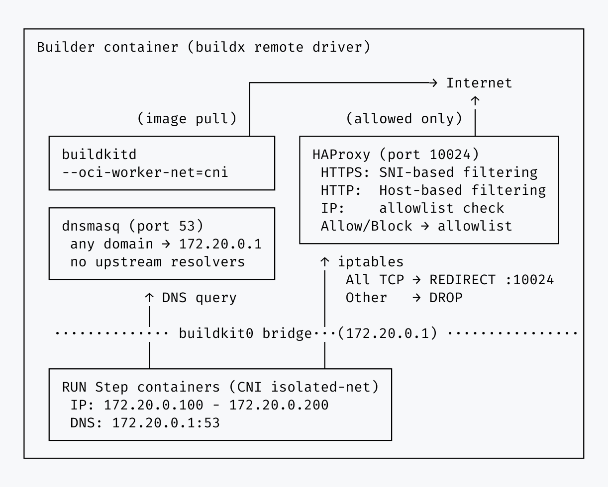
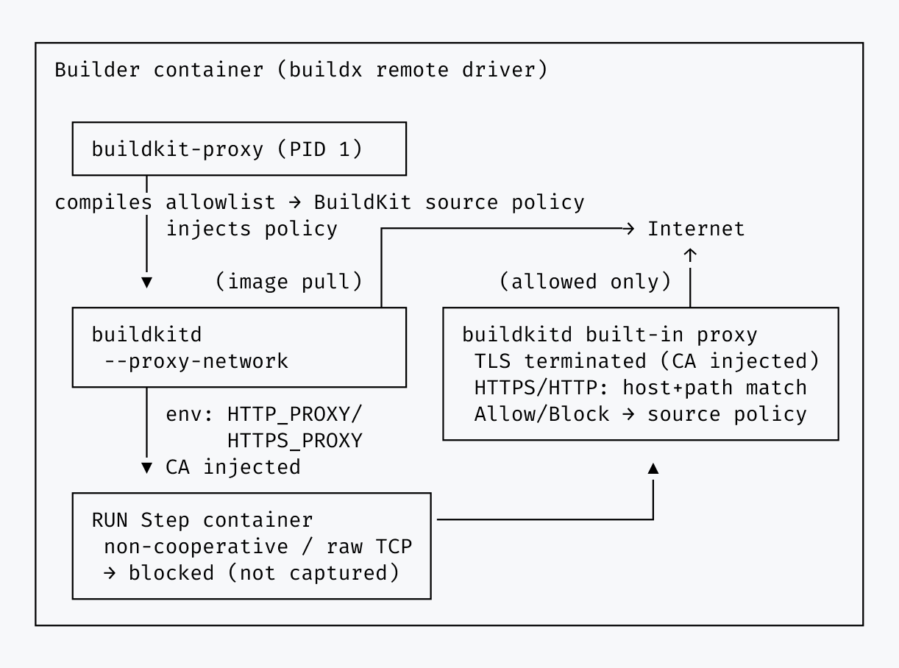

# Security Details

This document explains, from a user's perspective, how Buildcage enforces network isolation during
Docker builds: what's inspected, what's blocked, what attacks are resisted, and what's visible in the
report. For implementation internals (the supervisor binary, RPC plumbing, log parsing), see the
[Development Guide](./development.md).

For a high-level overview, see [How It Works](../README.md#how-it-works) in the README.

## Transparent Proxy Engine (default)

### Architecture



All containers spawned by BuildKit `RUN` steps are placed on an isolated network (CNI). Only **TCP** is intercepted — non-TCP protocols never reach the proxy at all (see [Non-TCP Protocol Tunneling](#non-tcp-protocol-tunneling-icmp-udp-quic)). DNS queries resolve to the proxy IP, and the proxy checks each request's SNI (HTTPS) or Host header (HTTP) against the allowlist before forwarding or blocking; direct-IP connections take a third, uninspected path (see below).

1. **BuildKit RUN steps run in isolated containers** connected to a private network (CNI)
2. **All TCP traffic is redirected to the proxy** via an iptables NAT rule — regardless of destination, so both DNS-resolved and direct-IP connections reach it; all other protocols (UDP, ICMP, etc.) are dropped before they ever reach the proxy
3. **All DNS queries return the proxy IP** (172.20.0.1), which is what lets the proxy classify DNS-resolved connections by SNI/Host header below
4. **The proxy classifies each TCP connection into one of three paths:**
   - HTTPS (DNS-resolved, TLS ClientHello seen): reads the SNI (Server Name Indication) without decrypting
   - HTTP (DNS-resolved, non-TLS): reads the Host header
   - Direct IP (connection target bypassed DNS): no content inspection at all — see [Direct IP Address Connections](#direct-ip-address-connections)
5. **Allowlist check:** If the domain (HTTPS/HTTP) or IP:port (direct IP) is allowed → connection proceeds. Otherwise → blocked.

**Note:** Base image pulls (`FROM` instructions) are performed by buildkitd itself, which runs outside the isolated network. Only commands in `RUN` steps are subject to network filtering.

**Why this approach?**
- No MITM certificate injection needed
- TLS certificate validation works normally
- Zero modification to your Dockerfile required
- Works with any programming language or package manager
- Cannot inspect encrypted HTTPS payload content (see [Known Limitations](#known-limitations))

### Security Mechanisms

#### Network Isolation

- **CNI configuration**: Places temporary containers from BuildKit RUN steps into isolated-net (buildkit0 bridge, 172.20.0.0/24).
- **iptables**: A `PREROUTING REDIRECT` rule sends all **TCP** traffic from buildkit0 to the proxy, regardless of destination. A separate `FORWARD` rule then drops everything else from buildkit0 — every non-TCP protocol, and any TCP that somehow bypasses the redirect — so only TCP ever reaches the proxy; also blocks direct access to buildkitd API.
- **Gateway enforcement**: All TCP traffic is redirected to the proxy process; non-TCP traffic never reaches it at all (dropped by the `FORWARD` rule above).

#### DNS-Level Control

- **Universal DNS redirect**: All domain name queries return the proxy IP (172.20.0.1), which lets the proxy classify TCP connections that go through DNS by SNI/Host header (see [Architecture](#architecture)). This is separate from the TCP redirect above — direct-IP connections skip DNS but still reach the proxy via the iptables redirect.
- **ECH prevention**: The internal DNS server operates without any upstream resolvers, so DNS HTTPS (type 65) records — required to initiate Encrypted Client Hello (ECH) — are never returned to build containers.

#### HTTP/HTTPS Proxy Control

- **HTTPS**: Determines the target server name by reading the SNI field, without terminating TLS. Certificate validation is unaffected.
- **HTTP**: Determines the target domain by inspecting the Host header, then checks it against the allowlist.
- **Dynamic allowlist**: Controlled via `allowed_https_rules`, `allowed_http_rules`, and `allowed_ip_rules` environment variables.
- **Missing Host header rejection**: HTTP requests without a valid Host header are rejected with HTTP 400, preventing requests that cannot be checked against the allowlist.

#### Direct IP Address Connections

- **Traffic redirection**: All TCP traffic from the isolated network is redirected to HAProxy via an iptables `PREROUTING REDIRECT` rule.
- **IP allowlist check**: Connections to raw IP addresses (e.g., `curl http://1.2.3.4/`) are checked against `allowed_ip_rules`, matched as `ip:port`. If no `allowed_ip_rules` are configured, all direct IP connections are blocked.
- **No content inspection**: Unlike the HTTPS/HTTP paths, a matched direct-IP connection is passed through as a raw TCP stream — its protocol is never checked. Once an `ip:port` pair is allowlisted, any TCP-based protocol can use that path, not just HTTP/HTTPS. Prefer domain-based rules (`allowed_https_rules` / `allowed_http_rules`) when possible; reserve `allowed_ip_rules` for destinations that genuinely have no stable hostname.

### Attack Resistance

Buildcage's architecture defends against the following attack vectors.

#### SNI Spoofing

An attacker may attempt to set the SNI field in a TLS ClientHello to an allowed domain while actually trying to reach an unauthorized server.

**Why this is prevented:** The proxy resolves the domain name presented in the SNI field using external DNS and forwards the connection to the resulting IP address. Regardless of what SNI value the client provides, the proxy always connects to the legitimate server for that domain — never to an attacker-controlled server.

#### Encrypted Client Hello (ECH)

TLS 1.3 Encrypted Client Hello (ECH) encrypts the true SNI, which could theoretically bypass SNI-based filtering.

**Why this is prevented:** ECH requires the client to obtain ECHConfig public keys via DNS HTTPS (type 65) records. The internal DNS server has no upstream resolvers and cannot return these records, so build containers can never initiate an ECH handshake.

#### DNS Tunneling

An attacker may attempt to encode data into DNS queries to exfiltrate information or establish communication with external servers.

**Why this is prevented:** The internal DNS server has no upstream resolvers and answers all queries locally. Additionally, all forwarded traffic from the isolated network is dropped by iptables — including any attempt to reach external DNS servers directly. With no path for DNS queries to reach the outside, encoded data has no route to an attacker's infrastructure.

#### Non-TCP Protocol Tunneling (ICMP, UDP, QUIC)

An attacker may attempt to tunnel data using non-TCP protocols such as ICMP echo packets, raw UDP, or QUIC (HTTP/3) to bypass the proxy.

**Why this is prevented:** The iptables FORWARD rule drops all traffic from the isolated network regardless of protocol — not just TCP. Since the proxy only handles TCP (HTTP, HTTPS, and allowlisted direct-IP connections — see [Architecture](#architecture)), there is no exit path for UDP or ICMP traffic. QUIC, which relies on UDP, is also blocked as a result.

#### IPv6 Bypass

An attacker may attempt to use IPv6 to circumvent IPv4-based iptables rules.

**Why this is prevented:** Equivalent ip6tables rules drop all forwarded IPv6 traffic from the isolated network. Additionally, the internal DNS server returns the IPv6 unspecified address (::) for all queries, effectively disabling IPv6 name resolution within build containers.

#### Alternative DNS Transports (DoH / DoT)

An attacker may attempt to use DNS over HTTPS (DoH) or DNS over TLS (DoT) to bypass the internal DNS server and resolve domains through encrypted channels.

**Why this is prevented:** DoT uses port 853, which the proxy does not listen on — making it unreachable from the isolated network. DoH operates over HTTPS and is therefore subject to the same SNI-based allowlist check as any other HTTPS connection. Only DoH servers hosted on explicitly allowed domains could be reached, and exploiting them would require the same preconditions as domain fronting (the attacker must control infrastructure behind an allowed domain).

### Known Limitations

#### Domain Fronting

Buildcage inspects the **SNI (Server Name Indication)** field in HTTPS connections but cannot decrypt the actual request content inside the TLS tunnel. This creates a potential bypass technique called "domain fronting."

**How it works:**

```
Attack flow:
1. ClientHello SNI: allowed.example.com  ← Buildcage only sees this → ✅ allowed
2. HTTP Host header: malicious.example.com  ← encrypted, cannot be inspected
3. CDN routes based on Host header → reaches attacker's server
```

For this attack to succeed, the allowed domain and the attack target domain must reside on **the same CDN or hosting infrastructure**.

**Why we don't prevent this:**

To fully defend against domain fronting, the proxy would need to terminate TLS (MITM) and inspect HTTP contents. However, this presents significant challenges:

- **MITM CA certificate generation and management** — The proxy would need to generate TLS certificates for each domain on the fly.
- **CA certificate injection into build containers** — Build containers generated by BuildKit's OCI worker have independent filesystems, making it technically difficult to trust a MITM CA (would require modifications to buildkitd itself).
- **Interference with TLS validation** — Trusting a self-signed CA would affect normal TLS certificate validation within build containers.

Given these implementation costs versus the strict preconditions for the attack (the attacker's server must be on the same infrastructure as the allowed domain), this is treated as an **accepted risk**.

**Mitigation strategies:**

- **Keep allowed domains to a minimum** — Only specify the domains you need in `allowed_http_rules` / `allowed_https_rules`.
- **Be specific with allowed domains** — Avoid broad wildcard CDN domains (e.g., `*.cdn.example.com`) when possible.
- **Use service-specific domains** — Prefer `registry.npmjs.org` over generic CDN wildcard domains.
- **Major CDN countermeasures** — Major CDN providers like CloudFront and Cloudflare have already introduced measures to restrict domain fronting. Consult your CDN provider's documentation for current details.
- **Regular audits** — Periodically run in [audit mode](./reference.md#operation-modes) to detect anomalies in connection patterns.

## Explicit Proxy Engine

> [!WARNING]
> `explicit` is an **experimental** engine. Its underlying BuildKit feature (`--proxy-network`) is
> still maturing, and it has structural limitations not present in the `transparent` engine — see
> [Coverage and known limitations](#coverage-and-known-limitations) below before relying on it.
> `transparent` remains the default and recommended engine.

### Architecture



`proxy_engine: explicit` uses BuildKit's native `--proxy-network` (available since moby/buildkit
v0.31.0) instead of the CNI/DNS-redirect/HAProxy stack described in
[Transparent Proxy Engine](#transparent-proxy-engine-default). Each `RUN` step is isolated into its
own private point-to-point network namespace whose only reachable peer is buildkitd's built-in MITM
proxy. `HTTP_PROXY`/`HTTPS_PROXY` and a generated CA certificate are injected into the step
automatically — no Dockerfile changes needed for tools that already respect these standard variables.
The proxy decrypts the traffic and checks the host against a BuildKit
[source policy](https://github.com/moby/buildkit/blob/master/docs/proxy.md) compiled from your
allowlist — the exact same `allowed_https_rules` / `allowed_http_rules` / `allowed_ip_rules` syntax as
`transparent` mode (see [Rule Syntax](./rules.md)). Enforcement is domain (and port) granularity, same
as `transparent` — the generated policy always allows any path once the host matches, since the rule
syntax has no path component. The decrypted path is still visible, so it shows up in the report and
BuildKit's own build output even though it isn't used to allow or deny the request. `allowed_ip_rules`
entries are compiled into the same kind of policy rule as domain rules (matched as an `https`/`http`
identifier) — unlike `transparent` mode, there's no raw, uninspected TCP passthrough for IP-based
rules here.

If the build client already sets its own **static** source policy (e.g. via
`EXPERIMENTAL_BUILDKIT_SOURCE_POLICY`, which `docker buildx build` reads unconditionally), buildcage
merges its own rules in last, so a client-supplied policy can never widen access beyond your
allowlist. A separate **dynamic**, session-based policy mechanism (`docker buildx build
--policy=...`) is left untouched and applies as an additional condition alongside buildcage's policy.

For how the supervisor binary, gRPC interception, and policy compilation work internally, see
[Explicit Engine Internals](./development.md#explicit-engine-internals) in the Development Guide.

### Coverage and Visibility

| Traffic | Allowed | Denied |
|---|---|---|
| `RUN` step, proxy-aware tool | Logged per-step in the report's "Communication details" | Logged in a flat `DENIED` list (no per-step attribution; whole-second timestamps) |
| `RUN` step, non-cooperative tool or raw socket | — (immediate "network unreachable"; **no trace anywhere** — not in the build log, the report, or provenance) | same as above |
| `ADD <url>` | Not tracked by the report — the URL is developer-specified in the Dockerfile, already an intentional, reviewable part of the build | Aborts the entire build immediately at LLB load time; logged the same way as a denied `RUN` |
| `FROM` / git contexts | Unaffected — buildcage's policy only ever matches `http(s)://` sources | Unaffected |

The key structural difference from `transparent` mode: there, a non-cooperative process still reaches
the CNI bridge and is observed, blocked, and logged. Under `explicit`, each `RUN` step's network
namespace has no broader network to route through, so that traffic leaves no trace at all — a
structural trade-off for gaining full path-level visibility and BuildKit-native provenance
integration.

For exactly how the `report` action extracts allowed/denied data from buildkitd's own logs, see
[Viewing Logs](./development.md#viewing-logs) in the Development Guide.

## Run Action

> [!WARNING]
> `run` is an **experimental** action. It hasn't seen the same real-world exposure as the
> `setup`/`report` build-isolation actions yet — see [Known Limitations](#known-limitations-1) below
> before relying on it.

The `run` action ([Reference](./reference.md#run-action)) applies the same isolation
technology as the `transparent` engine — iptables redirect, DNS redirect, SNI/Host-based
allowlist proxy — to an arbitrary `run:` command instead of a BuildKit `RUN` step.
Its threat model differs from the two build engines above in one important way: the process being
isolated is a full shell command chosen by the workflow author, running with the same privileges as
the Actions runner itself (rather than inside a BuildKit-managed OCI container), so isolating its
*network* access is not sufficient on its own — the isolated command must also be structurally
unable to reach outside its sandbox by other means (escalating privileges, reaching the Docker
socket, or reading another process's memory).

The core design goal is to let you bolt network egress control onto an existing workflow step
without changing how the rest of that workflow already works. A step that configures AWS
credentials, an npm/yarn cache directory, or any other action keeps running exactly as it did
before `run` was introduced — `run` only wraps the specific command whose network access you want
restricted, rather than requiring the surrounding job to move into a differently-configured
environment. This is why UID/GID and `$HOME` are preserved rather than switched to a dedicated
sandbox account (see UID/GID preserved below): tools and caches that assume the runner's own
identity keep working unmodified.

### Isolation Mechanisms

The isolated command runs as an [OCI](https://github.com/opencontainers/runtime-spec) container
under [runc](https://github.com/opencontainers/runc) — the same reference container runtime
`explicit`/`transparent` already trust indirectly via `moby/buildkit` — rather than being wrapped
directly by `unshare`/`setpriv` on the runner host. `run-isolated.sh` only sets up what runc cannot:
wiring a veth pair directly into the proxy container's own netns, and bind-mounting the host's own
`/` for runc's rootfs (`pivot_root` can't target `/` itself). Everything else below is declared in
an OCI `config.json` and enforced by runc natively.

- **Network namespace**: the isolated command runs in its own network namespace, connected to the
  proxy container's netns by a dedicated veth pair (no bridge — it's always a 1:1 connection, one
  sandbox to one proxy) — the same enforcement `transparent` mode applies to Docker `RUN` steps
  (iptables `REDIRECT`/`DROP`, DNS redirect, SNI/Host allowlist). runc joins this namespace itself,
  driven by the OCI spec's `linux.namespaces` path — no wrapper needed.
- **Seccomp filter**: derived from Docker's own default seccomp profile (allowlist-based;
  `moby/profiles`), resolved against an empty capability set to match the capability drop below —
  so any syscall Docker's default profile only conditionally allows for a *held* capability is
  excluded outright. This directly closes the gap historical `io_uring` and unprivileged
  user-namespace-creation CVEs relied on: `unshare(2)`/`clone(2)` with `CLONE_NEWUSER` and the
  `io_uring_*` syscall family are not in the resulting allowlist at all. Generated at `run` action
  startup (not baked into the image at build time), since a handful of the profile's rules are
  gated on the actual kernel version — see `run/docker/gen-seccomp-profile/main.go`.
- **Capability bounding set**: fully cleared (all five capability sets emptied in `config.json`)
  before the command executes. This is what actually makes privilege escalation impossible — even
  if the command invokes `sudo` or a setuid binary, there is no `CAP_NET_ADMIN`/`CAP_SYS_ADMIN`/etc.
  left for it to acquire, regardless of the resulting effective UID.
- **`no_new_privileges`**: set as defense-in-depth alongside the capability drop, so setuid/setgid
  binaries and file capabilities can't grant anything even in edge cases the capability drop
  doesn't cover on its own.
- **Supplementary groups cleared**: `docker` and any other supplementary group membership is
  dropped (the OCI spec's `process.user` carries no `additionalGids`). Runner users are typically
  members of the `docker` group, which is equivalent to root — the Docker daemon will happily mount
  `/` into a new privileged container for anyone who can reach its socket, regardless of that user's
  own capabilities. Group membership is what gates that reach, not capabilities, so it has to be
  cleared independently.
- **PID namespace**: the isolated command runs in its own PID namespace. This isn't just about
  hiding other processes from `ps` — the Linux kernel structurally forbids a process from tracing
  (`ptrace`) or reading `/proc/<pid>/mem` for any process outside its own PID namespace's lineage,
  independent of capabilities. This closes off memory-dump-based attacks against the Actions runner
  process itself.
- **UID/GID preserved**: unlike the mechanisms above, the isolated command keeps the same UID/GID
  as the runner user rather than switching to a dedicated unprivileged account. This is a deliberate
  choice: `actions/setup-node`-installed toolchains, `$GITHUB_WORKSPACE` file ownership, and
  `$HOME`-based caches (`~/.npm`, `~/.cache`, etc.) all assume the runner's own UID, and switching
  UID would break them. Isolation here comes entirely from the capability/group/namespace
  mechanisms above, not from UID separation. No user namespace is created for this either — that
  would let the isolated command re-acquire a (namespace-local) root identity via the very
  unprivileged-`CLONE_NEWUSER` primitive the seccomp filter above is specifically closing off.
- **Sensitive `/proc` paths masked**: `/proc/kcore`, `/proc/kallsyms`, `/proc/kmsg`,
  `/proc/sysrq-trigger`, `/proc/timer_list`, and `/proc/keys` are bind-mounted over with `/dev/null`
  (the OCI spec's `linux.maskedPaths`, extending runc's own sensible defaults), closing off
  kernel-memory-adjacent information disclosure paths that aren't already covered by the capability
  drop.
- **Filesystem read-only outside the workspace/home/tmp**: `$GITHUB_WORKSPACE`, `$HOME`, `/tmp`, and
  `$RUNNER_TEMP` are bind-mounted as writable exceptions on top of a read-only root (`root.readonly`
  in `config.json`, applied by runc itself). This closes off tampering with anything outside those
  paths — e.g. rewriting a binary earlier on `$PATH` to plant a payload for a later, non-sandboxed
  step in the same job. The rest of the host filesystem, including nested mounts, stays fully
  *visible* (read-only) so existing tools keep working; only writes are restricted. The writable
  exceptions are recursive bind-mounts (preserving any legitimately nested mounts under them); the
  sandbox's own `mount --rbind /` rootfs is staged under `/var/tmp/buildcage`, which is never one of
  those writable exceptions, so that recursion doesn't re-expose it as a second, writable copy of
  the whole host `/`. A `writable:` input naming that directory (or an ancestor of it) is rejected
  outright — see [Known Limitations](#known-limitations-1) below. The `writable` input adds further
  paths to the writable set for tools that need to write elsewhere (e.g. a cache directory); setting
  it to `/` disables this restriction entirely — see
  [Filesystem Access](./reference.md#filesystem-access) in Reference.
- **Die-with-parent**: the isolated command's life is tied to `run-isolated.sh`'s own via a two-hop
  `setpriv --pdeathsig=KILL` chain (`run-isolated.sh` → `runc run` → the isolated command — `runc
  run`'s own process sits between the two, so a single-hop guard wouldn't be enough). If
  `run-isolated.sh` is killed outright (e.g. an out-of-memory kill lands on it specifically), the
  whole sandboxed process tree is killed with it rather than surviving as an orphan.

### Known Limitations

- **No AppArmor/SELinux/Landlock policy**: these would add path-level MAC restrictions on top of
  the capability-based model above. Not applied today; the isolation mechanisms above already
  close off the specific escape routes considered (privilege escalation, Docker-socket access,
  cross-namespace ptrace/memory access).
- **`writable:` cannot name the sandbox's own scratch directory**: a `run:` step's `writable:` input
  listing `/var/tmp/buildcage` (or an ancestor of it, e.g. `/var/tmp` or `/`) is rejected outright —
  that directory holds the run's own `mount --rbind /` rootfs, and the writable exceptions are
  recursive bind-mounts, so allowing it would recursively re-expose the whole host `/` inside the
  sandbox as a second, writable copy. This is a misconfiguration guard against an operator-supplied
  `writable:` value, not a defense against the isolated command itself (see
  [Filesystem Access](./reference.md#filesystem-access) in Reference).
- **Docker cannot be used inside the isolated command**: supplementary groups (including `docker`)
  are cleared before the command runs, so even where the Docker socket is visible through the
  read-only host filesystem, the isolated command has no permission to use it. A `run:` step that
  itself needs to invoke `docker` (build an image, run a container, etc.) cannot be wrapped by
  `run`.
- **Credential retrieval is intentionally not blocked**: `run` restricts *where* the isolated
  command can send network traffic and, since the filesystem is read-only outside
  `$GITHUB_WORKSPACE`/`$HOME`/`/tmp`, *where* it can persist a payload — but not what it reads. A
  compromised dependency can still read `~/.aws/credentials`, `~/.docker/config.json`, or similar
  local credential files anywhere on the filesystem; it just cannot exfiltrate them anywhere outside
  the allowlist. This mirrors the same design principle as the Docker build engines above (see the
  defense-in-depth note in the [README](../README.md#how-it-works)).
- **Linux only**: requires a Linux runner with passwordless `sudo` for the isolation setup itself
  (network namespace, veth, iptables) — the default on GitHub-hosted `ubuntu-*` runners. Not
  supported on Windows or macOS runners.
- **Rootful Docker assumed**: the isolation joins the proxy container's network namespace via its
  host-visible PID (`docker inspect .State.Pid`, entered as `/proc/<pid>/ns/net`). This assumes
  containers share the host PID namespace, as they do on the default GitHub-hosted runner setup.
  Under rootless Docker or `userns-remap`, that PID may not be directly reachable, so `run`
  is not currently supported on those setups.
- **Per-step overhead**: each `run` step starts and stops its own proxy container, rather than
  sharing one across steps in the same job — this keeps allowlists independently configurable per
  step and keeps the traffic report's step-to-container mapping unambiguous, at the cost of
  container startup overhead on jobs with many `run` steps.

## Trusting the Buildcage Image

Buildcage is a security tool — so it's fair to ask: *how do you trust Buildcage itself?*

The upstream image is verified at action startup via Sigstore: the signature cryptographically binds
the published image to the exact source commit SHA, so a tampered or substituted image fails
verification before use.

**Using the upstream image**

The simplest option. Pin to a commit SHA (or version tag) and update on your own schedule — the
Sigstore verification ensures you are always running exactly what was built from that commit.

**Self-hosting**

If you need to keep build infrastructure private or control exactly which version is deployed, you can
fork the repository and build the Docker image within your own infrastructure. See the
[Self-Hosting Guide](./self-hosting.md).

## Image Provenance Verification

Buildcage uses [Sigstore](https://sigstore.dev) keyless signing to cryptographically bind each release's Docker image to the CI workflow that built it.

### How it works

**Signing (at release time):** When a release tag is pushed, the `docker-publish.yml` workflow builds and signs the Docker image using a short-lived OIDC identity issued by GitHub Actions. The signature is stored as a **Sigstore Bundle v0.3** attached to the image via the OCI 1.1 Referrers API in GHCR. The bundle contains the signature, a Fulcio leaf certificate embedding the workflow identity, and a Rekor transparency log entry.

**Verification (at action startup, `main` phase):** The setup action verifies the image entirely in-process using `@sigstore/verify`, `@sigstore/tuf`, and `@sigstore/bundle` — no external binary (e.g. cosign) is downloaded or required. Running in the `main` phase ensures `docker/login-action` (if present) has already stored registry credentials before verification begins. The verification flow is:

```
1. Fetch manifest-list digest
       docker buildx imagetools inspect <image>:<tag>
       (uses docker login credentials — supports private packages)
            ↓
2. Fetch registry pull token
       GET https://ghcr.io/token?scope=repository:<repo>:pull
         → logged in (docker/login-action): Basic auth with Docker config credentials
         → not logged in: anonymous request (public packages only)
            ↓
3. Pull Sigstore Bundle from OCI Referrers API
       GET /v2/<repo>/referrers/<digest>  → locate bundle manifest
       GET /v2/<repo>/blobs/<bundleDigest> → fetch bundle JSON
            ↓
4. Cryptographic + identity verification (@sigstore/verify, TUF-backed trust root)
       verifyBundle(bundleJson, {
         certificateIssuer,       ← OIDC issuer enforced cryptographically
         certificateIdentityURI,  ← SAN regexp: workflow URL + ref/version
         certificateOIDs,         ← OID 1.13: Source Repository Digest (SHA pin)
       }, expectedDigest)
            ↓
5. Signed digest assertion (fail-closed)
       Parse DSSE payload → subject[].digest.sha256 (in-toto v1, --new-bundle-format)
                          or critical.image.docker-manifest-digest (legacy simple-signing)
       Must equal the digest fetched in step 1 (strict string equality)
       Mismatch → VERIFY_FAILED (closes the Referrers API attribution gap)
```

For **private self-hosted packages**, place `docker/login-action` before the buildcage setup step in your workflow and ensure the job has `packages: read` permission. Credentials stored by Docker login are picked up automatically.

All identity checks — OIDC issuer, signing workflow, ref/SHA claim, and manifest digest — are enforced inside the single `verifyBundle()` call, equivalent to cosign's `--certificate-oidc-issuer`, `--certificate-identity-regexp`, `--certificate-github-workflow-sha`, and the implicit digest-match that cosign performs against its target image argument.

### Identity matching by reference type

<table>
<thead>
<tr>
<th>How the action is pinned</th>
<th>Identity check</th>
<th>Mechanism</th>
</tr>
</thead>
<tbody>
<tr>
<td><code>@&lt;40-char SHA&gt;</code></td>
<td>Source Repository Digest <strong>strictly equals</strong> the pinned SHA</td>
<td><code>certificateOIDs</code> — Fulcio OID <code>1.3.6.1.4.1.57264.1.13</code>, raw byte match</td>
</tr>
<tr>
<td><code>@v2.2.0</code> (exact version)</td>
<td>SAN matches <code>...@refs/tags/v2\.2\.0(\.|$)</code></td>
<td><code>certificateIdentityURI</code> regexp</td>
</tr>
<tr>
<td><code>@v2</code> (major-floating)</td>
<td>SAN matches <code>...@refs/tags/v2(\.|$)</code></td>
<td><code>certificateIdentityURI</code> regexp</td>
</tr>
<tr>
<td>Branch name or local <code>./setup</code></td>
<td><strong>Hard fail</strong> — pin to a version tag or commit SHA</td>
<td>—</td>
</tr>
</tbody>
</table>

For strongest guarantees, pin to a **commit SHA**:

```yaml
uses: dash14/buildcage/setup@<40-char-sha> # vX.Y.Z
```

The SHA check is the core of tamper detection: it confirms the Docker image was built from exactly the same source tree as the pinned action commit. An image built from a different commit — even if signed — will fail verification.

### What this prevents

An attacker who can push a malicious image to `ghcr.io/dash14/buildcage` without compromising the repository cannot produce a valid Sigstore bundle. The bundle's Fulcio certificate requires a GitHub Actions OIDC token that is only issued during an actual workflow run on the real repository.

This is **one layer of a defense-in-depth strategy**, not a complete guarantee. It reduces the attack surface to the registry layer and forces attackers to compromise the GitHub account or the repository itself — raising the cost significantly and leaving an audit trail in the Rekor transparency log.

The binding of the image digest to the exact source commit SHA also serves as an alternative to reproducible builds: it establishes that the published artifact was produced from a specific source commit without requiring an independent rebuild.

### Verification Limitations

- **Account compromise**: If the repository owner's GitHub account or the repository itself is compromised, an attacker could trigger the release workflow and produce a legitimately-signed malicious image.
- **Trust in Sigstore infrastructure**: Verification relies on the availability and integrity of the Rekor transparency log and the Fulcio certificate authority. The TUF-backed trust root is fetched at verification time; a network outage will cause the main phase to hard-fail.
- **TOCTOU window**: The manifest digest is fetched before the bundle is pulled. A highly targeted attack that replaces the registry content in the window between these two steps would still succeed — though such an attack requires compromising the registry itself. Note that the subsequent `docker pull` is digest-pinned (`image@sha256:…`), so there is no TOCTOU between verification and the actual image pull; the residual window is limited to between the manifest-digest fetch and the bundle fetch.
- **Local/CI self-test bypass**: `BUILDCAGE_BUILD_TEST_HOOKS=1 pnpm build` compiles a `setup/dist/main.cjs` where a `BUILDCAGE_LOCAL_IMAGE_REF` escape hatch is reachable, used only by this repo's own `test_action` CI job and local development. The bypass logic lives in its own module (`core/lib/local-image-override.js`), loaded only via a dynamic `import()` behind this build-time flag; in every normal build (including every published release), rollup's own module-graph tree-shaking excludes that entire file from the bundle — not just the call to it. A consumer of the published `dash14/buildcage/setup@<ref>` action cannot reach it no matter what `env:` they set, since the code is physically absent from what they execute. `unit_test`'s CI job additionally asserts, by inspecting the built file directly, that a normal build never contains a live runtime read of `BUILDCAGE_BUILD_TEST_HOOKS` — guarding against a future refactor silently breaking that guarantee. See [development.md](./development.md#local-development) for details.
